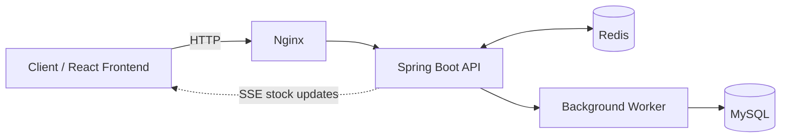
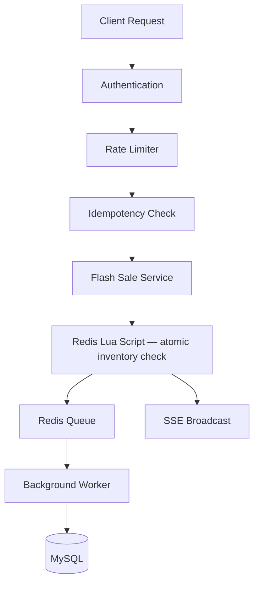

# Flash Sale Engine & API Rate Limiting Gateway

[](https://github.com/shubhamskadam89/rate-limiter-redis/actions/workflows/ci.yml)
[](https://hub.docker.com/r/shubhamkadam/flash-sale-backend)
[](https://hub.docker.com/r/shubhamkadam/flash-sale-frontend)
[](https://openjdk.org/projects/jdk/21/)
[](https://spring.io/projects/spring-boot)
[](https://redis.io/)
[](LICENSE)

---

## Overview

Flash Sale Engine & API Rate Limiting Gateway is a production-inspired distributed backend system built as a hands-on exploration of how modern backend systems handle high concurrency, maintain consistency, and scale reliably.

The project was developed incrementally by studying real-world backend engineering patterns, understanding the problems they solve, evaluating alternative approaches, implementing the chosen solution, validating it through testing and benchmarking, and documenting the engineering decisions behind each major component.

The platform consists of two complementary systems.

### API Rate Limiting Gateway

A distributed, Redis-backed rate limiting gateway supporting multiple algorithms including Fixed Window, Sliding Window, and Token Bucket. The gateway applies endpoint-aware and role-aware policies, allowing different APIs and user roles to enforce different traffic limits while sharing state across multiple backend instances.

### Flash Sale Engine

A high-concurrency purchase engine designed around consistency and correctness. It guarantees atomic inventory updates using Redis Lua scripts, prevents duplicate purchases through distributed idempotency, persists orders asynchronously to reduce request latency, broadcasts inventory changes in real time using Server-Sent Events (SSE), and supports horizontal scaling without sacrificing correctness.

Throughout the project, architectural decisions, trade-offs, benchmarks, implementation details, and lessons learned are documented to explain not only how each component works, but also why it exists and the engineering benefits it provides over simpler approaches.

---
## Why This Project Exists

Modern backend systems solve problems that rarely appear in traditional CRUD applications. Handling thousands of concurrent requests, preventing overselling, protecting APIs from abuse, processing retries safely, maintaining consistency across multiple instances, and observing system behaviour under load all require architectural decisions that go far beyond basic request-response programming.

This project began as an exploration of API rate limiting and gradually evolved into a complete flash sale platform as new engineering challenges emerged. Rather than implementing features in isolation, each major capability was introduced to solve a specific problem, understand the limitations of simpler approaches, evaluate alternative solutions, and validate the chosen design through testing and benchmarking.

The goal of this repository is to document that engineering journey—not just the final implementation. Every major decision is accompanied by its motivation, trade-offs, implementation details, validation strategy, and lessons learned, making the repository both a working system and a reference for understanding distributed backend engineering.

## Key Features

### Authentication & Authorization

- JWT-based authentication with role-based access control (RBAC)
- Access and refresh token workflow
- Protected administrative endpoints

### API Rate Limiting Gateway

- Runtime algorithm selection using the Strategy Pattern
- Endpoint-aware and role-aware rate limiting policies
- Fixed Window algorithm
- Sliding Window algorithm
- Token Bucket algorithm with Redis Lua
- Redis-backed distributed state shared across multiple application instances
- Dynamic rate limit configuration without application code changes

### Flash Sale Engine

- Atomic inventory management using Redis Lua scripts
- Zero oversell guarantee under concurrent load
- Distributed idempotent purchase processing
- Per-user purchase limits
- Asynchronous order persistence through Redis queues
- Real-time inventory updates using Server-Sent Events (SSE)

### Scalability & Reliability

- Horizontal scaling behind Nginx with shared Redis state
- Dockerized multi-service deployment
- Background workers for asynchronous processing
- Inventory consistency validation under concurrent load

### Observability & Quality

- Prometheus metrics and Grafana dashboards
- Comprehensive unit and integration testing
- Concurrency validation using multithreaded test suites
- k6 performance and load testing
- GitHub Actions CI/CD pipeline

## Architecture Snapshot

Requests flow through a layered pipeline — authentication, distributed rate limiting, and idempotency checks — before reaching the business layer. Redis holds all concurrency-sensitive state (rate limit counters, inventory locks, idempotency keys), while MySQL is the system of record. Because the application layer is stateless and backed by Redis, it's designed to scale horizontally behind Nginx without sacrificing consistency.

A purchase request executes an atomic Redis Lua script to validate inventory and enforce per-user limits, queues the order for asynchronous persistence, and immediately broadcasts the updated stock count to connected clients via SSE — so the write path never blocks on the database.

## Architecture Snapshot

Requests flow through a layered pipeline — authentication, distributed rate limiting, and idempotency checks — before reaching the business layer. Redis holds all concurrency-sensitive state (rate limit counters, inventory locks, idempotency keys), while MySQL is the system of record. Because the application layer is stateless and backed by Redis, it's designed to scale horizontally behind Nginx without sacrificing consistency.

A purchase request executes an atomic Redis Lua script to validate inventory and enforce per-user limits, queues the order for asynchronous persistence, and immediately broadcasts the updated stock count to connected clients via SSE — so the write path never blocks on the database.






> 📖 Full request-lifecycle sequence diagrams, deployment topology, and architectural decisions live in [docs/architecture.md](docs/architecture.md).

---

## Getting Started

### 🚀 Option 1 — Run with Docker (Recommended)

> The fastest way to explore the application. Pre-built images are pulled from Docker Hub.
> No Java, Maven, or Node.js installation required.
>
> **Best for:** Recruiters, interviewers, and anyone evaluating the project.

**Prerequisites:** [Docker Desktop](https://www.docker.com/products/docker-desktop/) (includes Docker Compose)

```bash
# 1. Clone the repository (needed for config files — nginx, prometheus, grafana)
git clone https://github.com/shubhamskadam89/rate-limiter-redis.git
cd rate-limiter-redis

# 2. Copy the environment file
cp .env.example .env

# 3. Start the full stack
docker compose up -d
```

That's it. Docker pulls the backend and frontend images from Docker Hub automatically.

| Service | URL |
|---|---|
| Application | http://localhost |
| Swagger UI | http://localhost/swagger-ui/index.html |
| Grafana | http://localhost/grafana &nbsp; *(admin / admin)* |
| Prometheus | http://localhost:9090 |

> **Default credentials** — Admin: `admin@example.com` / `password` &nbsp;·&nbsp; User: `user@example.com` / `password`

---

### 🛠 Option 2 — Build from Source

> Run the project locally for development or to explore and modify the implementation.
>
> **Best for:** Developers, contributors, and anyone learning the codebase.

**Prerequisites:** Java 21, Maven, Node.js 22, Docker Desktop

```bash
# 1. Clone the repository
git clone https://github.com/shubhamskadam89/rate-limiter-redis.git
cd rate-limiter-redis

# 2. Copy the environment file
cp .env.example .env

# 3. Start infrastructure (MySQL, Redis, Nginx, Prometheus, Grafana)
cd docker && docker compose up -d mysql redis prometheus grafana nginx

# 4. Run the backend
cd ../backend
./mvnw spring-boot:run

# 5. Run the frontend (in a separate terminal)
cd ../frontend
npm install
npm run dev
```

The frontend dev server starts at `http://localhost:5173`.

---

## Demo


The following screenshots demonstrate the core workflows implemented in the project.

| Authentication | Purchase Workspace |
|----------------|--------------------|
|  |  |

| Administration | Rate Limiting |
|---------------|---------------|
| | |

| Observability | Continuous Integration |
|---------------|------------------------|
| | 
 |

