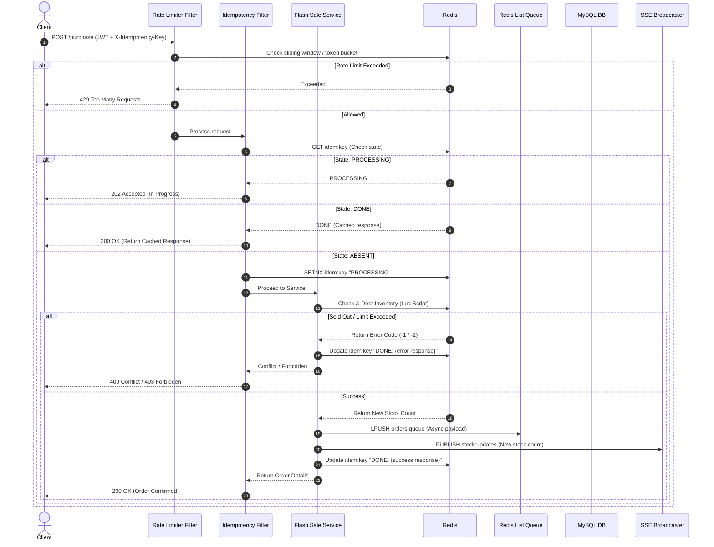

# Flash Sale Engine & API Rate Limiting Gateway

A high-performance, production-grade distributed system blueprint built with **Spring Boot 3.x**, **MySQL 8.x**, and **Redis 7.x**. This system addresses two core challenges in modern backend engineering:
1. **API Rate Limiting Gateway**: Implements three rate-limiting algorithms to protect public and internal APIs from abuse and DDoS attacks.
2. **Flash Sale Engine**: Handles high-concurrency purchase spikes with atomic inventory management, guaranteeing **zero oversell** and distributed **idempotency**.

---

## 1. System Architecture & Request Flow

The system uses a layered architecture where requests pass through filters (security, rate limiting, and idempotency) before reaching the controller and service layers. Redis serves as the single source of truth for real-time state, while MySQL serves as the transactional system of record.

### Request Lifecycle (POST `/api/v1/sales/{saleId}/purchase`)



### Architectural Decision: Redis vs. Database for Real-Time State

At **5,000+ concurrent requests**, running a traditional SQL update such as `UPDATE products SET inventory = inventory - 1 WHERE id = X AND inventory > 0` causes MySQL to acquire row-level locks, serializing the execution. This results in transaction queues, thread starvation, and request latencies climbing to **200–800ms**.

**Redis resolves this by:**
1. Running in a **single-threaded event loop**, which guarantees that operations are processed sequentially and atomically.
2. Keeping all state in **in-memory data structures**, executing read-and-decrement actions in **<1ms**.
3. Utilizing **Lua scripts** to bundle state validation (checking inventory and user purchase limits) and state updates (decrementing stock) into a single, execution-atomic operation.

---

## 2. Technology Stack Selection

*   **Backend Framework**: Spring Boot 3.x (compiled with Java 21, taking advantage of Virtual Threads to close the reactive-Servlet performance gap).
*   **Redis Client**: **Lettuce** (Non-blocking, shares a single physical connection, and supports reactive pipelines).
*   **Database**: MySQL 8.x (System of record for users, products, sales, and order persistence).
*   **ORM**: Spring Data JPA + Hibernate (configured with selective `@EntityGraph` loading to prevent the $N+1$ query problem).
*   **Observability**: Micrometer + Prometheus + Grafana (for request counters, latency histograms, and rate-limiting metrics).
*   **Load Testing**: **k6** (Dockerized, scriptable JavaScript test suites for concurrency tests).

---

## 3. Database Design (MySQL 8.x)

The database structure features version-controlled Flyway schema migrations separating users, sales, and configuration schemas.

### Schema Definitions

#### `V1__initial_schema.sql` (Core Catalogue)
```sql
CREATE TABLE users (
    id            BIGINT UNSIGNED AUTO_INCREMENT PRIMARY KEY,
    uuid          VARCHAR(36)  NOT NULL UNIQUE,
    email         VARCHAR(255) NOT NULL UNIQUE,
    password_hash VARCHAR(255) NOT NULL,
    role          ENUM('USER','VIP','ADMIN') NOT NULL DEFAULT 'USER',
    is_active     BOOLEAN NOT NULL DEFAULT TRUE,
    created_at    DATETIME(3) NOT NULL DEFAULT CURRENT_TIMESTAMP(3),
    updated_at    DATETIME(3) NOT NULL DEFAULT CURRENT_TIMESTAMP(3) ON UPDATE CURRENT_TIMESTAMP(3),
    deleted_at    DATETIME(3) NULL,
    INDEX idx_email (email),
    INDEX idx_uuid (uuid),
    INDEX idx_deleted_at (deleted_at)
);

CREATE TABLE products (
    id          BIGINT UNSIGNED AUTO_INCREMENT PRIMARY KEY,
    uuid        VARCHAR(36)  NOT NULL UNIQUE,
    name        VARCHAR(255) NOT NULL,
    description TEXT,
    base_price  DECIMAL(12,2) NOT NULL,
    metadata    JSON,
    is_active   BOOLEAN NOT NULL DEFAULT TRUE,
    created_at  DATETIME(3) NOT NULL DEFAULT CURRENT_TIMESTAMP(3),
    updated_at  DATETIME(3) NOT NULL DEFAULT CURRENT_TIMESTAMP(3) ON UPDATE CURRENT_TIMESTAMP(3),
    deleted_at  DATETIME(3) NULL,
    INDEX idx_uuid (uuid)
);
```

#### `V2__flash_sale_schema.sql` (Transactions & Sales)
```sql
CREATE TABLE sale_events (
    id              BIGINT UNSIGNED AUTO_INCREMENT PRIMARY KEY,
    uuid            VARCHAR(36)  NOT NULL UNIQUE,
    product_id      BIGINT UNSIGNED NOT NULL,
    sale_price      DECIMAL(12,2) NOT NULL,
    total_inventory INT UNSIGNED  NOT NULL,
    final_count     INT UNSIGNED  NULL, -- Populated by reconciliation job
    max_per_user    TINYINT UNSIGNED NOT NULL DEFAULT 1,
    start_time      DATETIME(3) NOT NULL,
    end_time        DATETIME(3) NOT NULL,
    status          ENUM('DRAFT','ACTIVE','ENDED','CANCELLED') NOT NULL DEFAULT 'DRAFT',
    created_by      BIGINT UNSIGNED NOT NULL,
    created_at      DATETIME(3) NOT NULL DEFAULT CURRENT_TIMESTAMP(3),
    updated_at      DATETIME(3) NOT NULL DEFAULT CURRENT_TIMESTAMP(3) ON UPDATE CURRENT_TIMESTAMP(3),
    FOREIGN KEY (product_id) REFERENCES products(id),
    FOREIGN KEY (created_by) REFERENCES users(id),
    INDEX idx_status_start (status, start_time),
    INDEX idx_uuid (uuid)
);

CREATE TABLE orders (
    id              BIGINT UNSIGNED AUTO_INCREMENT PRIMARY KEY,
    uuid            VARCHAR(36)  NOT NULL UNIQUE,
    user_id         BIGINT UNSIGNED NOT NULL,
    sale_event_id   BIGINT UNSIGNED NOT NULL,
    product_id      BIGINT UNSIGNED NOT NULL,
    quantity        TINYINT UNSIGNED NOT NULL DEFAULT 1,
    unit_price      DECIMAL(12,2) NOT NULL,
    total_price     DECIMAL(12,2) NOT NULL,
    status          ENUM('PENDING','CONFIRMED','CANCELLED') NOT NULL DEFAULT 'CONFIRMED',
    idempotency_key VARCHAR(36)  NOT NULL UNIQUE,
    created_at      DATETIME(3) NOT NULL DEFAULT CURRENT_TIMESTAMP(3),
    updated_at      DATETIME(3) NOT NULL DEFAULT CURRENT_TIMESTAMP(3) ON UPDATE CURRENT_TIMESTAMP(3),
    FOREIGN KEY (user_id)       REFERENCES users(id),
    FOREIGN KEY (sale_event_id) REFERENCES sale_events(id),
    FOREIGN KEY (product_id)    REFERENCES products(id),
    INDEX idx_user_sale (user_id, sale_event_id),
    INDEX idx_sale_event (sale_event_id),
    INDEX idx_idempotency (idempotency_key)
);
```

#### `V3__rate_limit_config.sql` (Gateway Configurations)
```sql
CREATE TABLE rate_limit_configs (
    id               BIGINT UNSIGNED AUTO_INCREMENT PRIMARY KEY,
    endpoint_pattern VARCHAR(255) NOT NULL,
    algorithm        ENUM('FIXED_WINDOW','SLIDING_WINDOW','TOKEN_BUCKET') NOT NULL,
    requests_limit   INT UNSIGNED NOT NULL,
    window_seconds   INT UNSIGNED NOT NULL,
    burst_capacity   INT UNSIGNED NULL,
    refill_rate      DECIMAL(8,2) NULL,
    applies_to_role  ENUM('USER','VIP','ADMIN','IP') NOT NULL DEFAULT 'USER',
    is_active        BOOLEAN NOT NULL DEFAULT TRUE,
    created_at       DATETIME(3) NOT NULL DEFAULT CURRENT_TIMESTAMP(3),
    updated_at       DATETIME(3) NOT NULL DEFAULT CURRENT_TIMESTAMP(3) ON UPDATE CURRENT_TIMESTAMP(3),
    UNIQUE KEY uq_endpoint_role (endpoint_pattern, applies_to_role),
    INDEX idx_active (is_active)
);
```

---

## 4. Redis Key & State Design

All Redis keys are strictly formatted using the pattern: `{feature}:{algorithm_or_type}:{identifier}:{sub_identifier}`.

| Redis Key | Data Structure | TTL | Purpose |
| :--- | :--- | :--- | :--- |
| `rate:fw:{endpoint}:{userId}` | **STRING** | `window_seconds` | Fixed Window counter. |
| `rate:sw:{endpoint}:{userId}` | **SORTED SET** | `2 * window_seconds` | Sliding Window request timestamp log. |
| `rate:tb:{endpoint}:{userId}` | **HASH** | None | Token bucket states (`tokens`, `last_refill`). |
| `idem:{idempotency_key}` | **STRING** | `86400s` (24h) | Stores `PROCESSING` flag or completed JSON response. |
| `inventory:{saleId}` | **STRING** | `sale_duration + buffer` | Atomic stock counter. |
| `user_purchases:{saleId}:{userId}`| **HASH** | `sale_duration + 1h` | Keeps track of quantity purchased per user. |
| `sale_meta:{saleId}` | **HASH** | `30s` | Cached MySQL metadata for rapid checks. |
| `orders:queue` | **LIST** | None | FIFO async processing queue (LPUSH -> BRPOP). |
| `stock:updates:{saleId}` | **Pub/Sub Channel**| None | Publishes inventory counts to SSE clients. |

---

## 5. Rate Limiting Algorithms

### 1. Fixed Window Counter
A lightweight counting algorithm using `INCR` and standard key expiration.
*   **Vulnerability**: Allows up to $2 \times \text{Limit}$ traffic at the window boundary.
*   **Java Code Outline**:
```java
public RateLimitResult checkLimit(String userId, String endpoint, RateLimitConfig config) {
    String key = RedisKeyBuilder.fixedWindow(endpoint, userId);
    Long count = stringRedisTemplate.opsForValue().increment(key);
    if (count == 1) {
        stringRedisTemplate.expire(key, config.getWindowSeconds(), TimeUnit.SECONDS);
    }
    long remaining = Math.max(0, config.getRequestsLimit() - count);
    if (count > config.getRequestsLimit()) {
        return RateLimitResult.blocked(remaining, config.getWindowSeconds());
    }
    return RateLimitResult.allowed(remaining);
}
```

### 2. Sliding Window Log
Prevents the boundary vulnerability by maintaining a log of request timestamps in a Sorted Set (ZSET).
*   **Cost**: Memory scales as $O(N)$ with the rate limit ($1,000 \text{ req/min} \approx 80\text{KB}$ per active user).
*   **Java Code Outline**:
```java
public RateLimitResult checkLimit(String userId, String endpoint, RateLimitConfig config) {
    String key = RedisKeyBuilder.slidingWindow(endpoint, userId);
    long now = System.currentTimeMillis();
    long windowStart = now - (config.getWindowSeconds() * 1000L);

    List<Object> results = stringRedisTemplate.executePipelined((RedisCallback<Object>) conn -> {
        conn.zRemRangeByScore(key.getBytes(), 0, windowStart); // prune old
        conn.zAdd(key.getBytes(), now, (now + "").getBytes()); // record current
        conn.zCard(key.getBytes()); // count transactions
        conn.expire(key.getBytes(), config.getWindowSeconds() * 2L); // set safety TTL
        return null;
    });

    Long count = (Long) results.get(2);
    long remaining = Math.max(0, config.getRequestsLimit() - count);
    if (count > config.getRequestsLimit()) {
        return RateLimitResult.blocked(remaining, config.getWindowSeconds());
    }
    return RateLimitResult.allowed(remaining);
}
```

### 3. Token Bucket (Lua Engine)
Allows handling short, sudden burst traffic gracefully by accumulating tokens up to a capacity.
*   **Lua Execution Script (`token_bucket.lua`)**:
```lua
local key          = KEYS[1]
local capacity     = tonumber(ARGV[1])   -- max burst capacity
local refill_rate  = tonumber(ARGV[2])   -- tokens added/sec
local now          = tonumber(ARGV[3])   -- epoch millisecond

local data = redis.call('HMGET', key, 'tokens', 'last_refill')
local tokens      = tonumber(data[1]) or capacity
local last_refill = tonumber(data[2]) or now

-- Refill tokens based on time elapsed
local elapsed = (now - last_refill) / 1000.0
local refilled = math.min(capacity, tokens + elapsed * refill_rate)

if refilled < 1 then
    return {0, math.floor(refilled * 1000)} -- Blocked: 0, ms until next token
end

-- Consume token
local new_tokens = refilled - 1
redis.call('HMSET', key, 'tokens', new_tokens, 'last_refill', now)
return {1, math.floor(new_tokens)} -- Allowed: 1, remaining tokens
```

---

## 6. Flash Sale Engine & Core Transactions

### Zero Oversell Execution (Lua)
Guarantees absolute atomicity on inventory checks, decrements, and user limits in a single step.
*   **Lua Execution Script (`flash_sale_purchase.lua`)**:
```lua
local inventory_key      = KEYS[1]      -- inventory:{saleId}
local user_purchase_key  = KEYS[2]      -- user_purchases:{saleId}:{userId}
local quantity           = tonumber(ARGV[1])
local max_per_user       = tonumber(ARGV[2])

-- 1. Verify stock availability
local current = tonumber(redis.call('GET', inventory_key))
if current == nil or current < quantity then
    return {-1, 0} -- Code: SOLD_OUT
end

-- 2. Verify per-user purchasing caps
local already_purchased = tonumber(redis.call('HGET', user_purchase_key, 'qty')) or 0
if already_purchased + quantity > max_per_user then
    return {-2, already_purchased} -- Code: LIMIT_EXCEEDED
end

-- 3. Perform atomic updates
local new_inventory = redis.call('DECRBY', inventory_key, quantity)
redis.call('HINCRBY', user_purchase_key, 'qty', quantity)

return {new_inventory, already_purchased + quantity} -- Code: Success
```

### Asynchronous Order Persistence Queue
1. Once the Lua script returns successfully, the request is placed on a Redis List queue: `LPUSH orders:queue {payload}`.
2. A background `OrderPersistenceJob` runs a blocking daemon (`BRPOP orders:queue 0`) which pulls entries off the queue and saves them in batches to the MySQL database.
3. If database errors occur, the job retries with exponential backoff, shielding the critical write path from direct spikes.

---

## 7. Scaling Strategy: 1K to 10M Users

```
   Stage 1                  Stage 2                 Stage 3                 Stage 4
 (0 - 10K Users)        (10K - 100K Users)       (100K - 1M Users)       (1M - 10M Users)
┌───────────────┐       ┌────────────────┐      ┌────────────────┐      ┌────────────────┐
│  Spring Boot  │  ──>  │ 2x Spring Boot │ ──>  │ Kubernetes Pod │ ──>  │ Microservices  │
│  Standalone   │       │  Nginx Router  │      │  HPA Scaling   │      │ Regional Shard │
└───────────────┘       └────────────────┘      └────────────────┘      └────────────────┘
┌───────────────┐       ┌────────────────┐      ┌────────────────┐      ┌────────────────┐
│  Standalone   │  ──>  │ Redis Sentinel │ ──>  │ Redis Cluster  │ ──>  │ Isolated Redis │
│     Redis     │       │ Master/Replica │      │ 6 Shards Total │      │ Per Sale Event │
└───────────────┘       └────────────────┘      └────────────────┘      └────────────────┘
┌───────────────┐       ┌────────────────┐      ┌────────────────┐      ┌────────────────┐
│  Single Node  │  ──>  │ Read Replicas  │ ──>  │ Connection Pool│ ──>  │ Database Table │
│   MySQL DB    │       │ Browse Traffic │      │ ProxySQL Layer │      │ Sharded Vitess │
└───────────────┘       └────────────────┘      └────────────────┘      └────────────────┘
```

1.  **Stage 1: 0–10,000 Users (Single Instance)**: Single Spring Boot instance, single Redis Node, standalone MySQL. Good for local testing and development.
2.  **Stage 2: 10,000–100,000 Users (Horizontal Scale)**: 2x Spring Boot behind Nginx. Redis moves to a Sentinel setup (1 master, 2 replicas) to prevent shared rate-limit state from breaking. MySQL read replicas handle browse traffic.
3.  **Stage 3: 100,000–1,000,000 Users (Cluster Mode)**: Kubernetes auto-scaling (HPA) triggers scaling from 0. Redis scales to a **6-node Redis Cluster** (3 shards, 3 replicas). Hash tags (`{userId}:rate:sw`) must be introduced to force keys onto the same cluster slots. MySQL uses connection proxies (ProxySQL). Redis queue shifts to Kafka for massive consumer group parallelism.
4.  **Stage 4: 1M–10M Users (Sharded Architecture)**: Isolated Redis instances are deployed dynamically per flash sale. Database tables are sharded using Vitess. The rate-limiting layer shifts from Sliding Window (high memory) to Fixed Window or Count-Min Sketch. Distributed idempotency logging moves to Cassandra.

---

## 8. Development & Verification Guide

### Crucial Concurrency Test
The test suite includes a multithreaded test using a Java `CountDownLatch` to simulate high-concurrency race conditions. This test validates that out of $500$ threads competing for $100$ items, **exactly 100 purchases succeed** and no oversell occurs.

```java
@Test
void testConcurrentPurchases_noOversell() throws InterruptedException {
    int INVENTORY = 100;
    int THREADS   = 500; // 5x Oversubscribed

    // Load inventory into Redis
    redisTemplate.opsForValue().set("inventory:" + SALE_ID, String.valueOf(INVENTORY));

    CountDownLatch startGate = new CountDownLatch(1);
    CountDownLatch endGate   = new CountDownLatch(THREADS);
    AtomicInteger successCount = new AtomicInteger(0);
    AtomicInteger soldOutCount = new AtomicInteger(0);

    for (int i = 0; i < THREADS; i++) {
        final long userId = i;
        executor.submit(() -> {
            try {
                startGate.await(); // Hold all threads until released
                PurchaseResult result = flashSaleService.purchase(SALE_ID, userId, 1);
                if (result.isSuccess()) successCount.incrementAndGet();
                else soldOutCount.incrementAndGet();
            } catch (Exception e) {
                soldOutCount.incrementAndGet();
            } finally {
                endGate.countDown();
            }
        });
    }

    startGate.countDown(); // Release all 500 threads simultaneously
    endGate.await(30, TimeUnit.SECONDS);

    // Assert absolute correctness
    assertEquals(INVENTORY, successCount.get(), "Exactly " + INVENTORY + " purchases must succeed");
    assertEquals(THREADS - INVENTORY, soldOutCount.get());
    assertEquals("0", redisTemplate.opsForValue().get("inventory:" + SALE_ID), "Redis inventory must hit exactly 0");
}
```
