# System Architecture

## 1. Purpose

The Flash Sale Engine & API Rate Limiting Gateway was built to explore how modern backend systems solve high-concurrency problems while remaining maintainable, scalable, and observable.

This document describes the architecture of the system from an engineering perspective. Rather than focusing on implementation details, it explains how the major components collaborate, the responsibilities assigned to each subsystem, and the architectural principles that guided the overall design.

Throughout the project, every significant architectural decision was made to address a specific engineering problem—whether preventing overselling, protecting APIs from abusive traffic, safely handling duplicate requests, or designing the application so it can support horizontal scaling. Those decisions are introduced here at a high level. Detailed implementation notes, engineering trade-offs, validation evidence, and Architecture Decision Records (ADRs) are maintained separately to keep this document focused on the overall system design.

The architecture intentionally favors clear separation of responsibilities, stateless application services, distributed shared state, and evidence-driven engineering. Every major design decision is supported by implementation, automated tests, benchmarks, operational metrics, or documented rationale rather than assumptions.

> **Why this matters**
>
> Understanding a system requires more than reading its source code. By documenting the responsibilities, interactions, and reasoning behind each architectural decision, this document provides the context needed to understand not only how the system works, but why it was designed this way.

## 2. Architectural Principles

The architecture is guided by a small set of engineering principles that influenced every major design decision throughout the project. Rather than being isolated concepts, these principles work together to shape how requests are processed, how state is managed, and how the system evolves over time.

---

### 1. Stateless Application Layer

Application instances are designed to remain stateless. Any state that must be shared across requests or backend instances is stored externally rather than inside application memory.

This allows multiple backend instances to process requests interchangeably without relying on sticky sessions or instance-specific data. Authentication remains stateless through JWTs, while Redis serves as the shared state store for concurrency-sensitive operations.

> **Why this matters**
>
> Stateless services simplify horizontal scaling, improve fault tolerance, and ensure that requests can be routed to any healthy backend instance without affecting correctness.

---

### 2. Separation of Responsibilities

Each subsystem is responsible for solving a single engineering problem. Authentication verifies identity, rate limiting protects APIs, idempotency guarantees safe retries, the flash sale engine enforces business rules, asynchronous workers handle persistence, and observability provides operational visibility.

Keeping responsibilities isolated reduces coupling between components and allows individual subsystems to evolve without introducing unnecessary complexity elsewhere in the application.

> **Why this matters**
>
> Clearly defined boundaries improve maintainability, simplify testing, and make architectural decisions easier to reason about as the project grows.

---

### 3. Distributed Shared State

Concurrency-sensitive data is treated as shared system state rather than application-local state. Components that coordinate concurrent requests rely on a centralized state store, while durable business data is maintained separately within the persistence layer.

This separation distinguishes transient coordination state from long-term business records, allowing each type of data to be managed by the technology best suited to its requirements.

> **Why this matters**
>
> Centralizing distributed state allows the system to scale horizontally while preserving correctness and consistency across multiple application instances.

---

### 4. Correctness Before Optimization

Operations that affect business correctness always prioritize consistency over raw throughput. Inventory updates, purchase validation, and idempotent request handling are designed to execute atomically before considering performance optimizations.

Performance improvements such as asynchronous persistence and in-memory coordination are introduced only after correctness guarantees are established.

> **Why this matters**
>
> Optimizing an incorrect system simply produces incorrect results faster. Establishing correctness first provides a reliable foundation for future scalability improvements.

---

### 5. Evidence-Driven Engineering

Architectural decisions are supported by implementation, automated tests, concurrency validation, benchmarking, operational metrics, and documentation. Features are introduced to solve identifiable engineering problems rather than to demonstrate technologies.

When limitations exist, they are documented explicitly rather than hidden behind assumptions or future intentions.

> **Why this matters**
>
> Engineering decisions become more valuable when they are supported by measurable evidence. This approach makes the architecture easier to evaluate, reproduce, and extend over time.

## 3. System Overview

The Flash Sale Engine & API Rate Limiting Gateway combines two complementary backend systems into a single platform that addresses different aspects of high-concurrency request processing.

The **API Rate Limiting Gateway** protects backend services by enforcing configurable request policies based on endpoints, user roles, and runtime-selected rate limiting algorithms. Instead of embedding traffic control into individual services, rate limiting is treated as a dedicated infrastructure concern backed by Redis.

The **Flash Sale Engine** focuses on maintaining correctness under concurrent purchase requests. It coordinates inventory management, purchase validation, idempotent request handling, asynchronous order persistence, and real-time inventory updates while ensuring that limited stock cannot be oversold.

Although each subsystem solves a different problem, they share the same architectural principles. Both rely on stateless application services, Redis as the distributed coordination layer, MySQL as the persistent system of record, and supporting operational components for monitoring, deployment, and scalability.

The following diagram provides a high-level view of the major components and their relationships.

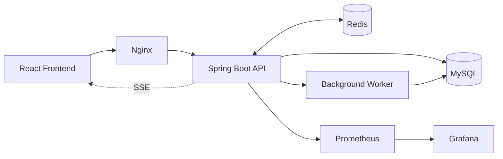

> **Why this matters**
>
> Separating the platform into focused subsystems keeps individual responsibilities clear while allowing shared infrastructure such as Redis, MySQL, and observability components to support the entire application. This approach makes the system easier to understand, extend, and validate as new capabilities are introduced.

## 4. System Components

The platform is composed of a small number of well-defined components, each responsible for solving a specific engineering problem. By assigning a single primary responsibility to each component, the architecture remains modular, easier to reason about, and simpler to evolve as new capabilities are introduced.

| Component | Primary Responsibility |
|------------|------------------------|
| **React Frontend** | Provides the user interface for authentication, administration, purchasing, and real-time inventory updates. |
| **Nginx** | Serves as the entry point to the platform, routing incoming requests to backend instances and enabling horizontal scaling. |
| **Spring Boot Backend** | Implements authentication, business logic, rate limiting, purchase processing, idempotency, and exposes APIs consumed by the frontend. |
| **Redis** | Acts as the distributed coordination layer for concurrency-sensitive operations including rate limiting, inventory management, idempotency, asynchronous queues, and Pub/Sub messaging. |
| **MySQL** | Serves as the persistent system of record for users, products, sales, and completed purchase orders. |
| **Background Worker** | Processes asynchronous purchase events and persists successful orders to MySQL without blocking client requests. |
| **Prometheus** | Collects application and infrastructure metrics for monitoring and performance analysis. |
| **Grafana** | Visualizes metrics through dashboards to provide operational insight into system behavior under load. |

> **Why this matters**
>
> Assigning clear responsibilities to each component keeps the architecture modular and reduces unnecessary coupling between subsystems. Rather than allowing every component to solve multiple concerns, each service focuses on a well-defined responsibility, making the system easier to understand, test, maintain, and scale.

## 5. Request Lifecycle

Understanding the platform requires more than knowing which components exist—it requires understanding how they collaborate while processing requests.

Although different endpoints perform different business operations, every request follows the same architectural pipeline. Requests enter through the reverse proxy, are authenticated, evaluated against security and rate limiting policies, and only then reach the business layer.

Operations that require strong consistency, such as purchases, continue through additional coordination steps including idempotency validation, atomic inventory updates, asynchronous persistence, and real-time event publication.

The following sections illustrate the request lifecycle for the three primary interaction patterns implemented by the system:

- Authentication requests
- Purchase requests
- Real-time inventory updates

### Authentication Request

Authentication establishes the identity of the client before any protected resources can be accessed. Rather than maintaining user sessions on the server, the application issues JSON Web Tokens (JWTs) after successful authentication. Subsequent requests present the token, allowing every backend instance to validate requests independently.

This approach keeps the application layer stateless while eliminating the need for session replication between backend instances.

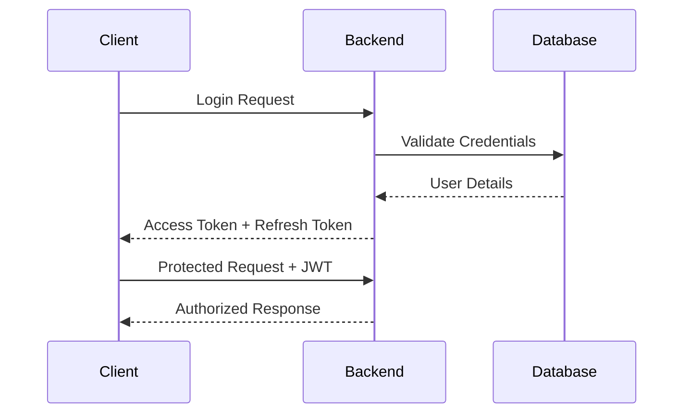

> **Why this matters**
>
> Stateless authentication allows requests to be processed by any backend instance without relying on server-side sessions. This simplifies horizontal scaling while reducing operational complexity.

> **Related ADR**
>
> ADR-006 — Authentication & Authorization *(Planned)*

### 5.2 Purchase Request

The purchase workflow is the most concurrency-sensitive operation in the system. During a flash sale, multiple users may attempt to purchase the same limited inventory simultaneously. The architecture is designed to guarantee correctness under concurrent load while keeping the request path lightweight and responsive.

Before inventory is modified, the request passes through authentication, rate limiting, and idempotency validation. Once these checks succeed, the Flash Sale Engine executes a Redis Lua script that atomically validates inventory availability, enforces per-user purchase limits, and reserves stock. If the purchase succeeds, the request is acknowledged immediately while order persistence is delegated to a background worker through an asynchronous Redis queue. Inventory changes are simultaneously published to connected clients using Server-Sent Events (SSE).

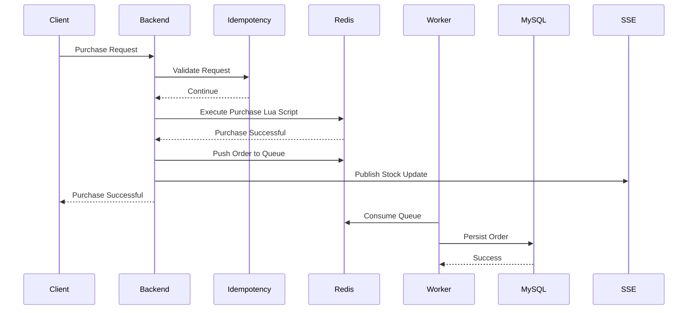

> **Why this matters**
>
> Separating inventory reservation from database persistence minimizes request latency while preserving correctness. Atomic Redis execution prevents overselling under concurrent load, asynchronous persistence keeps the purchase path responsive, and SSE ensures every connected client receives inventory updates without polling.

> **Related ADR**
>
> ADR-002 — Atomic Purchase Flow *(Planned)*

### 5.3 Real-Time Inventory Updates

During a flash sale, inventory changes continuously as purchases succeed. Requiring every client to repeatedly poll the server for updated stock would generate unnecessary network traffic and increase backend load, particularly during periods of high demand.

To provide immediate feedback while keeping the communication model lightweight, the application uses **Server-Sent Events (SSE)**. Clients establish a persistent connection when entering the purchase workspace. Whenever inventory changes, the backend publishes an update that is streamed directly to every subscribed client without requiring additional requests.

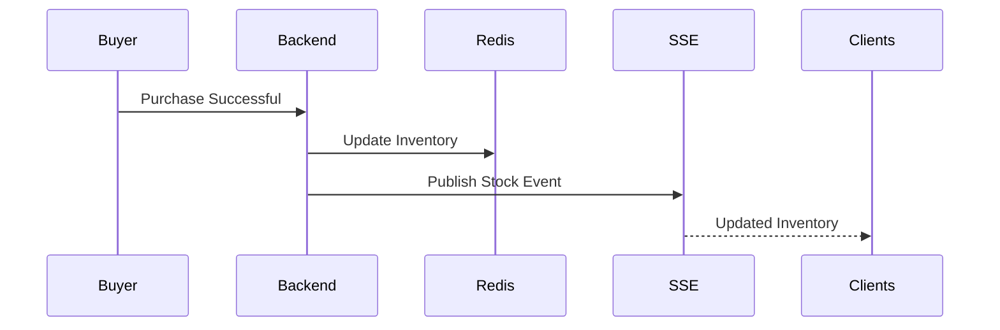

> **Why this matters**
>
> Using Server-Sent Events allows the server to push inventory updates only when changes occur, eliminating unnecessary polling while ensuring every connected client observes inventory changes almost immediately. This improves both user experience and backend efficiency during high-concurrency events.

## 6. API Protection Architecture

Protecting an API involves more than limiting the number of requests a client can send. Different endpoints serve different purposes and operate under different constraints. Authentication endpoints must resist brute-force attacks, purchase endpoints must remain stable during flash sales, administrative operations require different protection policies than public APIs, and general application traffic should not be constrained by rules designed for high-value transactions.

Applying a single rate limiting algorithm across every endpoint would ignore these differences, forcing one strategy to solve fundamentally different problems.

To address this, the application implements a **policy-driven API protection architecture**. Instead of coupling endpoints directly to a specific algorithm, each endpoint is assigned a **rate limiting policy** that describes how requests should be protected. The policy defines request limits, window sizes, burst capacity, refill behavior, and the rate limiting algorithm to execute. During request processing, the application resolves the appropriate policy, selects the corresponding strategy at runtime, and delegates enforcement to the selected implementation. This entire workflow is executed transparently by the request interception layer before the request reaches the business logic, allowing controllers to remain focused solely on application behavior.

This architecture separates **policy definition** from **algorithm implementation**, allowing protection rules to evolve through configuration without requiring changes to application code.

> **Why this matters**
>
> Treating API protection as a policy-driven subsystem rather than a collection of independent algorithms keeps the architecture flexible and maintainable. Endpoint behavior can evolve by changing policies instead of modifying business logic, while new algorithms can be introduced without affecting request processing or controller implementations.

> **Related ADR**
>
> ADR-001 — Runtime-Configurable API Protection *(Planned)*

### 6.1 Policy-Driven Request Classification

Every incoming request must first be classified before an appropriate protection strategy can be applied. Rather than hardcoding rate limiting rules around URL patterns or controller implementations, the application classifies requests using explicit rate limiting policies.

Controllers and individual endpoints declare their required protection through the `@RateLimit` annotation. During request interception, the `RateLimitPolicyResolver` inspects the handler method to determine which policy should govern the request. Method-level annotations take precedence over controller-level annotations, allowing individual endpoints to override broader controller defaults when necessary. If no annotation is present, the request is assigned the `GENERAL` policy.

This approach decouples endpoint behavior from implementation details. Controllers simply express the level of protection they require, while the API protection subsystem determines how that policy should be enforced.

Current policies implemented by the system include:

| Policy | Intended Use |
|----------|--------------|
| **AUTH** | Authentication endpoints that require protection against brute-force attacks. |
| **TRANSACTION** | Purchase operations where controlled traffic and fairness are critical. |
| **GENERAL** | Default protection applied to standard application endpoints. |
| **ADMIN** | Administrative operations with higher throughput requirements for privileged users. |

> **Why this matters**
>
> Separating endpoint classification from enforcement keeps controllers free from infrastructure concerns. New endpoints can adopt existing protection policies—or introduce new ones—without modifying the rate limiting implementation itself, making the system easier to evolve and maintain.

### 6.2 Identity Resolution

Once a request has been classified, the application determines **who** the rate limit should be applied to. Rather than binding the implementation to a single identity source, the API protection layer resolves a rate limiting identity before any algorithm is executed.

For authenticated requests, the identity is derived from the authenticated JWT subject, ensuring that limits follow the user regardless of the client or backend instance processing the request. For unauthenticated requests, where no user identity exists, the client IP address becomes the fallback identity.

This produces a consistent identity model for every request while allowing the underlying rate limiting algorithms to remain completely independent of authentication mechanisms.

| Request Type | Identity Used |
|--------------|---------------|
| Authenticated User | JWT Subject (User ID) |
| Anonymous Request | Client IP Address |

By resolving identity before algorithm selection, every rate limiting strategy operates on the same abstraction rather than dealing with authentication or HTTP-specific concerns.

> **Why this matters**
>
> Separating identity resolution from rate limiting algorithms keeps each strategy focused solely on enforcing limits. Authentication concerns remain isolated within the security layer, while the rate limiting subsystem simply receives a unified identity regardless of how it was resolved.

### 6.3 Runtime Strategy Selection

Once the request policy and client identity have been resolved, the application determines **how** the request should be evaluated. Rather than binding each policy to a specific implementation at compile time, the API protection layer selects the appropriate rate limiting strategy during request processing.

Each policy is backed by external configuration that defines the algorithm to execute together with its operational characteristics, including request limits, window duration, burst capacity, and refill rate where applicable. The `RateLimiterService` loads the policy configuration and delegates execution to the `StrategyFactory`, which returns the appropriate algorithm implementation.

This allows the protection behavior of an endpoint to evolve without modifying application code. Changing an endpoint from a Fixed Window policy to a Sliding Window policy, or introducing different limits for administrative endpoints, becomes a configuration change rather than a software change.

Current policy configuration:

| Policy | Algorithm | Primary Use |
|----------|-----------|-------------|
| **AUTH** | Sliding Window | Authentication endpoints |
| **TRANSACTION** | Token Bucket | Purchase operations |
| **GENERAL** | Fixed Window | General application traffic |
| **ADMIN** | Token Bucket | Administrative operations |

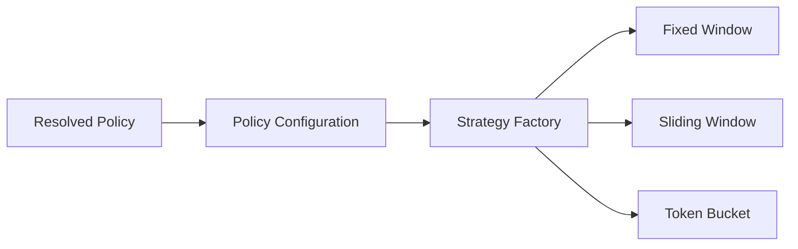

Unlike traditional implementations where a single algorithm protects every endpoint, the architecture allows different parts of the application to adopt protection strategies that better match their traffic characteristics and operational requirements.

> **Why this matters**
>
> Separating policy configuration from algorithm implementation makes the rate limiting subsystem both extensible and configurable. New algorithms can be introduced without modifying existing request processing, while operational teams can adjust protection policies through configuration rather than application code.

### 6.4 Distributed Rate Limiting

The API protection subsystem is designed so that rate limiting state resides entirely within Redis rather than application memory. Although the current deployment targets a single backend instance, storing counters and coordination data in Redis establishes a shared source of truth that avoids process-local state and prepares the subsystem for future horizontal scaling.

Each rate limiting strategy persists its operational state using Redis structures that best match its coordination requirements.

| Algorithm | Redis Data Structure | Coordination Strategy |
|-----------|----------------------|-----------------------|
| **Fixed Window** | String Counter | Atomic Redis increment with key expiration |
| **Sliding Window** | Sorted Set | Lua script for atomic window cleanup, insertion, and counting |
| **Token Bucket** | Redis Hash | Lua script for atomic token refill and consumption |

Algorithms that require multiple Redis operations execute through Lua scripts so that validation and state updates occur atomically. This eliminates race conditions that could otherwise appear under concurrent load while reducing network round trips between the application and Redis.

Redis key construction is standardized across all strategies, ensuring consistent namespacing for policies, identities, and algorithm-specific state.

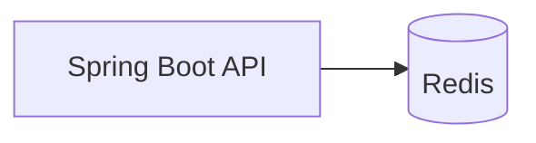

> **Why this matters**
>
> Centralizing rate limiting state in Redis keeps the application layer stateless and provides a consistent foundation for request coordination. Because enforcement no longer depends on process-local memory, the architecture is prepared for future horizontal scaling without requiring changes to the rate limiting subsystem.

> **Current Scope**
>
> The architecture has been validated in a single-backend deployment. Validation of multi-instance behavior behind Nginx is planned as part of the horizontal scaling milestone before the v1.0 release.

## 7. Flash Sale Architecture

Unlike traditional REST operations, flash sale systems must preserve business correctness while processing a large number of concurrent purchase requests against limited inventory. Multiple users may attempt to purchase the same item simultaneously, clients may retry requests because of network failures, and successful purchases must be persisted without introducing unnecessary latency into the request path.

These requirements make correctness the primary architectural concern. The system must ensure that inventory cannot be oversold, duplicate requests do not create duplicate purchases, purchase limits are enforced consistently, and successful purchases are eventually persisted without forcing every request to wait for database transactions.

To address these challenges, the Flash Sale Engine decomposes the purchase workflow into independent architectural responsibilities. Each stage solves a specific engineering problem while remaining isolated from the others.

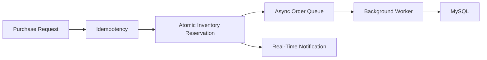

Rather than relying on a single database transaction to coordinate every stage of the purchase, the architecture distributes responsibility across specialized components. This separation keeps the request path responsive while ensuring that correctness guarantees are established before asynchronous work begins.

> **Why this matters**
>
> Breaking the purchase workflow into focused architectural stages allows each concurrency problem to be solved independently. Inventory consistency, duplicate request handling, persistence, and client notifications can evolve without introducing unnecessary coupling or compromising the correctness of the overall purchase flow.

> **Related ADR**
>
> ADR-002 — Atomic Purchase Flow *(Planned)*

### 7.1 Atomic Inventory Management

Inventory management is the foundation of the Flash Sale Engine. During periods of high demand, multiple purchase requests may attempt to reserve the same inventory simultaneously. If inventory validation and stock updates are performed as separate operations, concurrent requests can observe stale state, resulting in overselling or inconsistent purchase limits.

To prevent these race conditions, the application performs inventory validation and reservation as a single atomic operation within Redis. A Lua script coordinates inventory availability checks, per-user purchase limits, stock reservation, and purchase accounting without allowing other requests to observe an intermediate state.

The script returns explicit outcomes that allow the application to distinguish between successful purchases, exhausted inventory, purchase limit violations, and inventory initialization errors without requiring additional coordination logic.

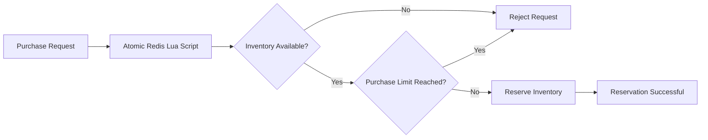

Unlike database-centric approaches that rely on transactions and row locking, the architecture establishes correctness within Redis before any persistence occurs. The database records the outcome of an already validated purchase rather than acting as the coordination mechanism for concurrent requests.

> **Why this matters**
>
> Treating inventory reservation as an atomic coordination problem rather than a database transaction eliminates race conditions during concurrent purchases. By guaranteeing inventory correctness before persistence begins, the architecture prevents overselling while keeping the purchase path lightweight and predictable under load.

> **Related ADR**
>
> ADR-002 — Atomic Purchase Flow *(Planned)*

### 7.2 Distributed Idempotency

Modern distributed systems cannot assume that every request is processed exactly once. Clients may retry requests because of network interruptions, browser refreshes, proxy timeouts, or uncertainty about whether a previous request completed successfully. Without additional coordination, these retries can result in duplicate purchases despite correct inventory management.

The Flash Sale Engine addresses this by introducing a distributed idempotency layer before inventory reservation begins. Every purchase request carries a unique idempotency key that represents a single logical operation rather than an individual HTTP request. Before processing the purchase, the application checks whether that operation has already been completed or is currently in progress.

If the request is new, processing continues normally. If an identical request is received while the original request is still executing, the duplicate is rejected. Once processing completes successfully, subsequent retries return the previously generated response instead of executing the purchase workflow again.

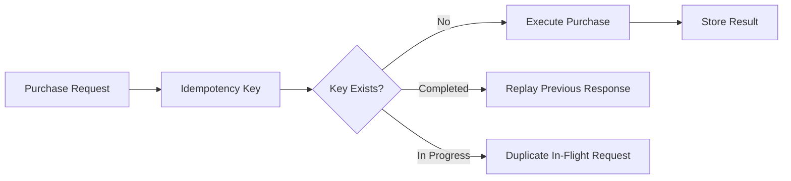

By treating idempotency as a distributed coordination problem rather than an application-memory concern, duplicate request handling remains consistent regardless of which backend instance processes the retry.

> **Why this matters**
>
> Atomic inventory management guarantees that concurrent users cannot oversell inventory, while distributed idempotency guarantees that the same user cannot accidentally execute the same purchase multiple times. Together, these mechanisms establish correctness for both concurrent requests and repeated requests.

> **Related ADR**
>
> ADR-003 — Distributed Idempotency *(Planned)*

### 7.3 Asynchronous Order Processing

Once a purchase has been validated, inventory has been reserved, and idempotency guarantees have been established, the remaining responsibility is to persist the completed purchase as a durable business record. Although this could be performed synchronously within the request lifecycle, doing so would unnecessarily extend request latency by coupling every successful purchase to database performance.

Instead, the Flash Sale Engine separates business correctness from persistence. After the purchase has been successfully coordinated within Redis, the application publishes an order event to a Redis-backed asynchronous queue and immediately returns a successful response to the client. A dedicated background worker consumes queued events and persists completed orders to MySQL independently of the original HTTP request.

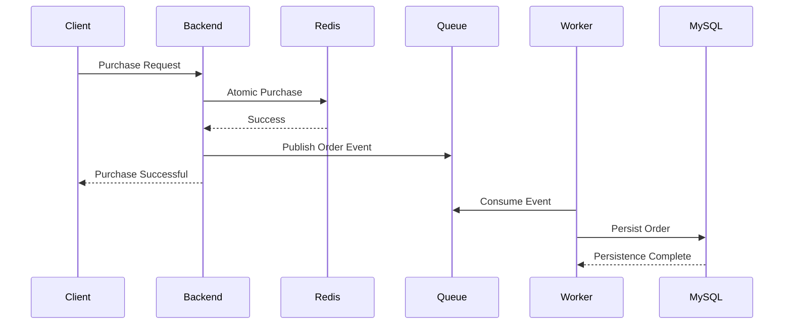

Separating persistence from request processing allows the application to acknowledge successful purchases immediately after business correctness has been established, while database operations continue independently in the background.

This design intentionally accepts **eventual persistence** rather than immediate database durability. Because inventory reservation has already completed successfully before the event is published, database performance no longer determines how quickly clients receive responses during periods of high demand.

> **Why this matters**
>
> Decoupling persistence from request processing keeps the critical purchase path focused on correctness rather than storage latency. This allows the system to remain responsive under heavy load while ensuring completed purchases are eventually recorded as durable business data.

> **Current Scope**
>
> The current implementation processes orders through a single background worker backed by a Redis queue. Retry behavior, dead-letter handling, and stronger delivery guarantees are intentionally deferred to future iterations as the architecture evolves.

> **Related ADR**
>
> ADR-004 — Asynchronous Order Processing *(Planned)*

### 7.4 Real-Time Inventory Notifications

Inventory correctness is only part of the flash sale experience. Once inventory changes, connected clients must observe those changes quickly enough to make informed purchasing decisions. Delayed or inconsistent inventory information can lead to poor user experience, unnecessary purchase attempts, and additional load caused by repeated refresh requests.

Rather than requiring clients to continuously poll the server for inventory changes, the Flash Sale Engine publishes inventory events immediately after a successful reservation. Connected clients receive these updates through Server-Sent Events (SSE), allowing inventory changes to propagate as soon as the purchase workflow completes.

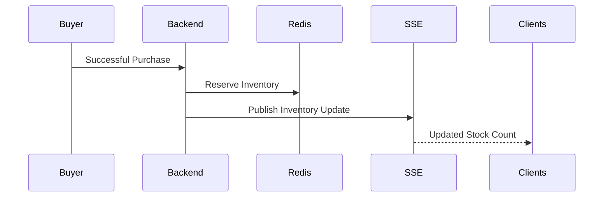

Because inventory notifications occur after the inventory reservation has completed successfully, every published update reflects the current coordinated inventory state rather than speculative or intermediate values.

> **Why this matters**
>
> Separating inventory coordination from client notification allows the system to maintain business correctness while providing immediate feedback to connected users. Clients receive accurate inventory updates without introducing polling overhead or coupling user experience to the persistence layer.

> **Related ADR**
>
> ADR-005 — Real-Time Inventory Streaming *(Planned)*

## 8. Distributed State Management

One of the defining architectural characteristics of the platform is the deliberate separation between **application logic** and **application state**. Rather than allowing backend instances to maintain request coordination in local memory, all concurrency-sensitive state is externalized into shared infrastructure. This allows the application layer to remain stateless while ensuring that every request is evaluated against a consistent view of the system.

Not all application data has the same lifecycle or consistency requirements. Some information exists only to coordinate concurrent requests, while other information represents durable business records that must be retained permanently. The architecture intentionally stores these categories of data in different systems, allowing each technology to focus on the responsibilities it is best suited to perform.

| State Category | Technology | Purpose |
|---------------|------------|---------|
| Authentication | JWT | Stateless client identity |
| Rate Limiting | Redis | Request coordination and traffic control |
| Inventory | Redis | Atomic stock management |
| Idempotency | Redis | Duplicate request prevention |
| Asynchronous Queue | Redis | Temporary event coordination |
| Business Records | MySQL | Durable system of record |

Redis acts as the platform's coordination layer rather than its permanent datastore. Information stored within Redis exists only for as long as it is required to coordinate concurrent operations. Once those operations complete, durable business information is persisted to MySQL, which remains the authoritative system of record.

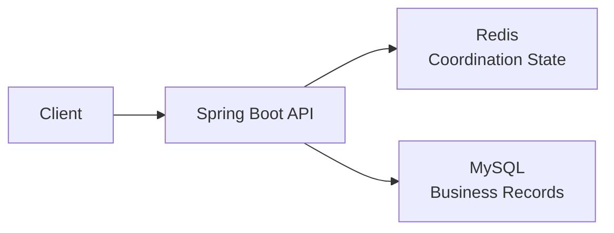

This separation allows different architectural concerns to evolve independently. Request coordination can prioritize speed, atomicity, and low latency, while business persistence focuses on durability, consistency, and long-term storage.

> **Why this matters**
>
> Separating transient coordination state from durable business data is one of the core architectural decisions in the system. By externalizing concurrency-sensitive state, the application remains stateless, simplifies future horizontal scaling, and avoids coupling business correctness to database transaction throughput.

> **Related ADR**
>
> ADR-008 — Distributed State Management *(Planned)*

## 9. Communication Patterns

The platform uses multiple communication patterns rather than relying on a single interaction model. Different architectural responsibilities have different consistency, latency, and coupling requirements. While synchronous communication is appropriate for client-facing operations, background processing and real-time notifications benefit from asynchronous messaging and event-driven communication.

Each communication mechanism is selected based on the problem it solves rather than adopting a single approach throughout the application.

| Communication Pattern | Purpose |
|-----------------------|---------|
| HTTP | Client request/response interactions |
| Redis Lua Scripts | Atomic coordination for concurrency-sensitive operations |
| Redis Queue | Asynchronous order persistence |
| Redis Pub/Sub | Internal event distribution |
| Server-Sent Events (SSE) | Real-time inventory updates to connected clients |

Together, these communication patterns separate immediate user interactions from background processing while allowing each subsystem to operate with the consistency guarantees it requires.

> **Why this matters**
>
> Using multiple communication patterns allows each architectural concern to adopt the interaction model best suited to its requirements. Client responsiveness, business correctness, asynchronous processing, and real-time updates can evolve independently without forcing every subsystem into the same communication model.

### 9.1 Synchronous Request Processing

Client-facing operations use a traditional synchronous request-response model over HTTP. Authentication, request validation, rate limiting, idempotency checks, and inventory reservation all execute within the lifecycle of a single request, allowing clients to receive an immediate and deterministic outcome.

Only operations that establish business correctness remain in the synchronous path. Once these guarantees have been established, longer-running work is delegated to asynchronous processing.

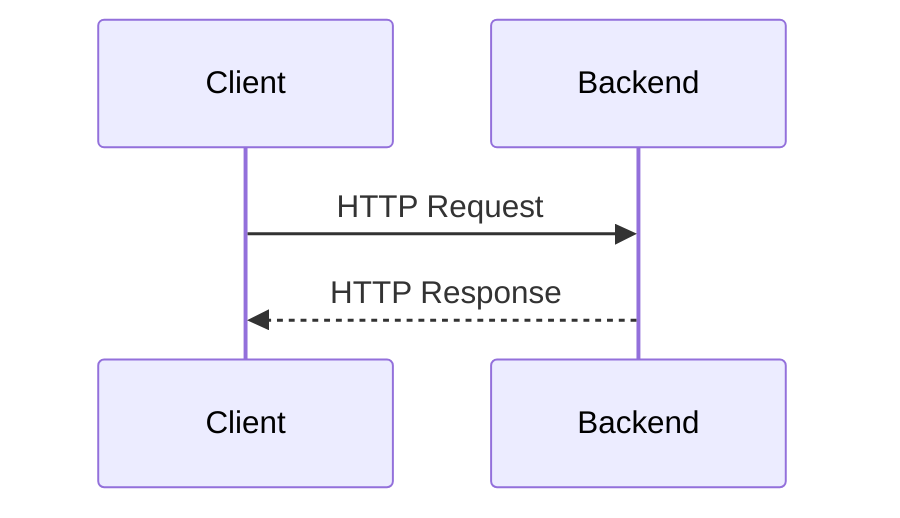

> **Why this matters**
>
> Restricting the synchronous request path to correctness-critical operations minimizes response latency while ensuring clients receive immediate confirmation of the outcome of their requests.

### 9.2 Atomic Coordination

Operations that modify shared state execute atomically within Redis through Lua scripts. Rather than issuing multiple independent Redis commands, the application performs validation and state updates as a single execution unit.

This communication pattern is used wherever correctness depends on multiple related operations completing without interference from concurrent requests.

> **Why this matters**
>
> Executing coordination logic atomically removes race conditions without requiring distributed locks or database transactions for every concurrent request.

### 9.3 Asynchronous Messaging

Not every operation requires an immediate response to the client. After business correctness has been established, completed purchase events are published to a Redis-backed queue where they are processed independently by a background worker.

This decouples request processing from database persistence and allows the application to remain responsive even when persistence becomes comparatively slower.

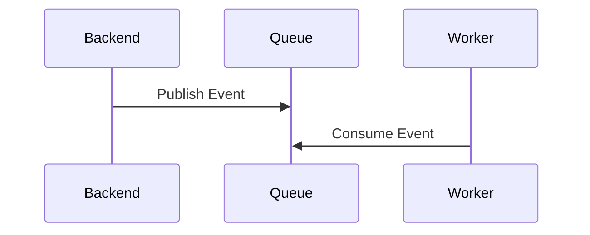

> **Why this matters**
>
> Asynchronous messaging isolates client-facing latency from persistence latency, allowing each subsystem to operate independently while preserving eventual consistency.

### 9.4 Event Streaming

Inventory updates are distributed using an event-driven model. Once inventory changes, the backend publishes an update that is streamed to all connected clients through Server-Sent Events.

Unlike request-response communication, this pattern allows the server to initiate communication only when meaningful state changes occur.

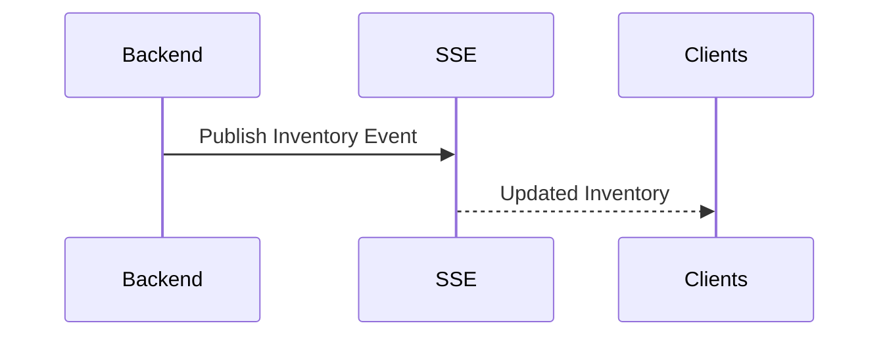

> **Why this matters**
>
> Event-driven communication keeps connected clients synchronized without requiring continuous polling, reducing unnecessary network traffic while improving the responsiveness of the user interface.

## 10. Deployment Topology

The platform is deployed as a collection of independent infrastructure components that collaborate to provide request processing, distributed coordination, persistence, monitoring, and client access. Although developed for local environments using Docker Compose, the deployment intentionally mirrors the separation of responsibilities expected in production systems.

Each service performs a single operational responsibility. The backend remains stateless, Redis coordinates distributed state, MySQL stores durable business records, Nginx provides a unified entry point, and the monitoring stack observes system behavior without participating in request processing.

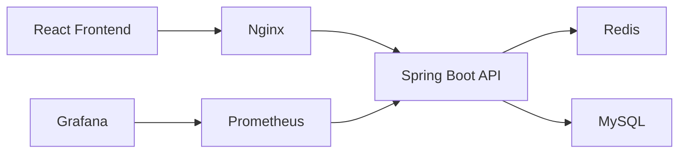

### Deployment Responsibilities

| Component | Responsibility |
|-----------|----------------|
| **React Frontend** | User interface for authentication, administration, purchasing, and monitoring inventory. |
| **Nginx** | Reverse proxy providing a single entry point for client traffic. |
| **Spring Boot API** | Stateless application responsible for request processing and business logic. |
| **Redis** | Shared coordination layer for rate limiting, inventory, idempotency, queues, and messaging. |
| **MySQL** | Durable persistence layer for business entities and completed purchases. |
| **Prometheus** | Collects metrics from application and infrastructure components. |
| **Grafana** | Visualizes operational metrics through dashboards. |

The deployment intentionally separates application logic from infrastructure concerns. Components communicate through clearly defined interfaces, allowing individual services to be replaced, upgraded, or scaled independently as the architecture evolves.

> **Why this matters**
>
> Separating operational responsibilities simplifies deployment, improves maintainability, and establishes clear boundaries between application logic, distributed coordination, persistence, and observability. This organization also prepares the architecture for future production-oriented improvements without requiring significant changes to the application itself.

## 11. Scalability Characteristics

Scalability is not determined by a single technology or deployment decision. It emerges from architectural choices that reduce coupling, externalize shared state, and isolate responsibilities. Throughout the platform, components have been designed so that future growth can be achieved through architectural evolution rather than fundamental redesign.

Several design decisions contribute to the system's scalability characteristics:

| Architectural Decision | Scalability Benefit |
|-------------------------|---------------------|
| Stateless application layer | Removes request affinity and simplifies horizontal scaling |
| JWT authentication | Eliminates server-side session replication |
| Redis-backed coordination | Externalizes concurrency-sensitive state from application memory |
| Runtime-configurable rate limiting | Allows endpoint protection policies to evolve independently |
| Asynchronous order processing | Prevents database latency from affecting request throughput |
| Independent infrastructure services | Allows monitoring, persistence, and coordination to evolve separately |

These decisions establish a foundation for scaling the application without introducing unnecessary coupling between business logic and infrastructure.

### Current Scope

The current implementation has been validated using a single backend instance with shared infrastructure services. Architectural decisions such as stateless request processing, externalized coordination state, and distributed rate limiting have been implemented with future horizontal scaling in mind, but multi-instance deployment has not yet been validated as part of the current version.

### Planned Validation

Future work will focus on validating the architecture under a multi-instance deployment behind Nginx. This includes verifying consistent behavior for authentication, distributed rate limiting, idempotency, purchase coordination, asynchronous processing, and real-time inventory updates while benchmarking throughput, latency, and resource utilization.

> **Why this matters**
>
> Scalability is treated as an architectural characteristic rather than a deployment feature. By separating application logic from shared coordination state and maintaining a stateless request-processing model, the platform establishes a foundation that can be incrementally validated and expanded without requiring significant architectural changes.

> **Related ADR**
>
> ADR-007 — Horizontal Scaling *(Planned)*

## 12. Architectural Trade-offs

Every architectural decision represents a balance between competing goals. Throughout the project, design choices were driven by the need to preserve correctness under concurrent load while keeping the system modular, observable, and maintainable. Rather than optimizing every aspect of the platform simultaneously, the architecture intentionally prioritizes clear responsibilities and incremental evolution.

The following table summarizes the major architectural decisions, the benefits they provide, and the trade-offs they introduce.

| Architectural Decision | Benefit | Trade-off |
|-------------------------|---------|-----------|
| Stateless application layer | Simplifies future horizontal scaling and removes server-side session affinity | Shared coordination state must be externalized |
| JWT-based authentication | Eliminates server-side session management | Token lifecycle and revocation become application concerns |
| Redis for coordination state | Provides fast, atomic coordination for concurrency-sensitive operations | Requires an additional infrastructure dependency |
| Redis Lua for inventory coordination | Guarantees atomic execution without distributed locks | Business coordination logic moves into Lua scripts |
| Distributed idempotency | Prevents duplicate request execution across retries | Requires lifecycle management of idempotency records |
| Asynchronous order persistence | Reduces request latency by removing database writes from the critical path | Persistence becomes eventually consistent |
| Server-Sent Events | Delivers efficient real-time inventory updates | Supports one-way server-to-client communication only |
| Policy-driven API protection | Allows endpoint behavior to evolve through configuration | Introduces additional abstraction within request processing |

None of these decisions are universally optimal. Each was selected because it best addressed the requirements and constraints of this project while remaining consistent with the architectural principles established at the beginning of this document.

Several operational capabilities—including horizontal scaling validation, stronger asynchronous delivery guarantees, advanced observability, and production deployment patterns—are intentionally deferred to future milestones. This allows the current architecture to remain focused on correctness, modularity, and evidence-driven engineering while providing a clear path for future evolution.

> **Why this matters**
>
> Architecture is defined as much by the trade-offs it accepts as by the technologies it adopts. Documenting these decisions provides the context needed to understand why the system was designed this way, what limitations are accepted today, and how future improvements can be introduced without fundamentally changing the architecture.

---

## 13. Related Architecture Decision Records

This document presents the architecture of the system at a high level. Individual engineering decisions, implementation details, trade-offs, validation results, and future refinements are documented separately through Architecture Decision Records (ADRs).

The following ADRs are planned to accompany the v1.0 architecture:

| ADR | Topic | Status |
|------|-------|--------|
| ADR-001 | Runtime-Configurable API Protection | Planned |
| ADR-002 | Atomic Purchase Flow | Planned |
| ADR-003 | Distributed Idempotency | Planned |
| ADR-004 | Asynchronous Order Processing | Planned |
| ADR-005 | Real-Time Inventory Streaming | Planned |
| ADR-006 | Authentication & Authorization | Planned |
| ADR-007 | Horizontal Scaling Validation | Planned |
| ADR-008 | Distributed State Management | Planned |

Each ADR focuses on a single architectural decision and documents:

- The engineering problem being addressed.
- The architectural decision that was made.
- Alternative approaches that were considered.
- Trade-offs introduced by the decision.
- Validation evidence, benchmarks, or operational observations where applicable.

Together, the architecture document and the ADRs provide complementary views of the system. This document explains **how the platform is structured**, while the ADRs explain **why individual architectural decisions were made**.

---

## 14. Conclusion

The Flash Sale Engine demonstrates how a collection of focused architectural decisions can be combined to solve high-concurrency problems while preserving correctness, maintainability, and operational visibility.

Rather than relying on a single technology or optimization, the architecture separates concerns across authentication, API protection, distributed coordination, asynchronous processing, and observability. Each subsystem exists to solve a specific engineering problem while remaining independently understandable and evolvable.

As the project continues, future milestones will validate horizontal scalability, strengthen operational guarantees, and document additional architectural decisions through dedicated ADRs, allowing the system to evolve while preserving the principles established in this document.

