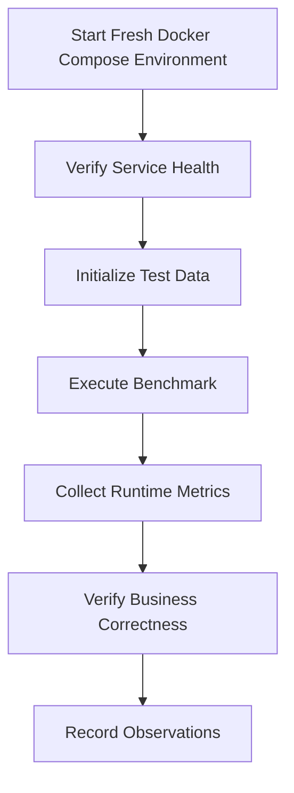
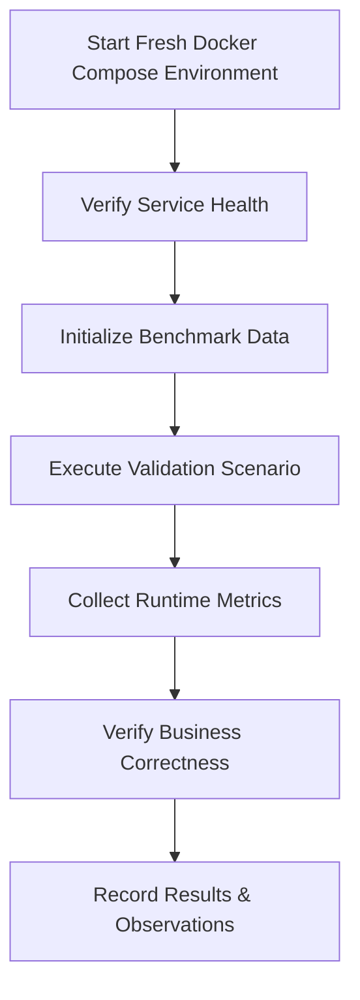
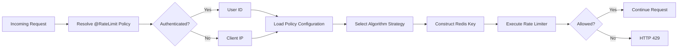

# Performance Validation Report

## 1. Introduction

Designing a high-concurrency backend system requires more than selecting appropriate technologies or implementing well-known architectural patterns. The reliability of a system is ultimately determined by how it behaves under realistic operating conditions. Architectural decisions such as Redis-backed rate limiting, atomic Lua scripts, asynchronous persistence, and idempotent request handling are valuable only if they demonstrably preserve correctness and predictable behaviour during concurrent execution.

This document presents the performance validation of the Flash Sale Engine & API Rate Limiting Gateway. It complements the architecture documentation by providing experimental evidence for the implemented design rather than introducing new architectural concepts. Whereas `architecture.md` explains how the system is designed, this report focuses on validating how the implementation behaves under controlled testing conditions.

Unlike traditional benchmark reports that primarily emphasise throughput or requests per second, this report prioritises engineering correctness. For transactional systems, maintaining business invariants under load is more important than achieving the highest possible throughput. A purchase system that processes one million requests per second while overselling inventory or creating duplicate orders is fundamentally incorrect regardless of its performance metrics.

The validation strategy therefore focuses on both performance characteristics and correctness guarantees. Performance metrics describe how efficiently the application processes requests, while correctness validation demonstrates that critical business rules remain satisfied throughout concurrent execution. Together, these measurements provide confidence that the implemented architecture behaves as intended under the scope of testing performed.

Every benchmark presented in this document is associated with a clearly defined engineering objective. Individual scenarios evaluate rate limiting behaviour, flash sale processing, idempotent request handling, asynchronous order persistence, and real-time inventory broadcasting. Where applicable, benchmark observations are supported by runtime metrics, application logs, Redis state, MySQL persistence, and automated verification tests.

Measured benchmark values included in this report represent observations from the tested environment only. They should not be interpreted as universal performance guarantees, as hardware specifications, deployment topology, runtime configuration, and workload characteristics significantly influence observed behaviour. The objective is reproducibility and engineering validation rather than publishing absolute performance numbers.

### 1.1 Objectives

The primary objectives of this report are to:

- Validate that the implemented architecture behaves correctly under concurrent load.
- Measure the performance characteristics of the current implementation.
- Verify critical correctness guarantees, including zero oversell, idempotent request handling, and rate limit enforcement.
- Compare the behaviour of the supported rate limiting algorithms under identical workloads.
- Correlate runtime observations with architectural decisions documented elsewhere in the project.
- Document current implementation limitations and identify areas requiring future validation.

### 1.2 Scope

This report covers validation of the current implementation within the supported single-instance deployment model.

The following areas are included:

- Functional verification through automated testing.
- Concurrency validation of purchase processing.
- Load testing using k6.
- Comparative evaluation of the implemented rate limiting algorithms.
- Validation of atomic inventory management.
- Verification of idempotent request handling.
- Runtime observability through Prometheus, Grafana, and application metrics.
- Engineering analysis of observed system behaviour.

The following topics are intentionally outside the scope of this report:

- Multi-instance performance benchmarking.
- Redis Cluster behaviour.
- Distributed database deployments.
- Kubernetes-based scalability testing.
- Cross-region or geographically distributed deployments.

These scenarios are planned for future iterations and will be documented only after experimental validation.

### 1.3 Document Structure

The remainder of this report is organised as follows:

- **Chapter 2** describes the hardware, software, and runtime environment used during testing.
- **Chapter 3** explains the validation methodology and testing strategy.
- **Chapter 4** defines each benchmark scenario together with its objectives and success criteria.
- **Chapter 5** compares the implemented rate limiting algorithms using identical workloads.
- **Chapter 6** presents benchmark observations and collected evidence.
- **Chapter 7** validates critical correctness guarantees.
- **Chapter 8** analyses the observed behaviour from an engineering perspective.
- **Chapter 9** discusses the current limitations of the implementation.
- **Chapter 10** summarises the findings of the validation process.

---
# 2. Validation Environment

Performance measurements are meaningful only when accompanied by a well-defined execution environment. Hardware specifications, deployment topology, runtime configuration, software versions, and infrastructure settings all influence observed behaviour. This chapter documents the environment used throughout the validation process to ensure that benchmark results are reproducible and interpreted within the appropriate context.

Unless otherwise stated, every benchmark, concurrency test, and correctness validation presented in this report was executed using the environment described below.

## 2.1 Deployment Topology

All performance measurements presented in this report were collected using the project's containerized deployment provided through Docker Compose.

Every application component was executed as an isolated Docker container, ensuring that the benchmarking environment closely matched the project's recommended deployment model and could be reproduced by anyone cloning the repository.

The deployed stack consisted of the following services:

| Component | Deployment |
|------------|------------|
| Backend | Docker Container |
| Frontend | Docker Container |
| MySQL | Docker Container |
| Redis | Docker Container |
| NGINX | Docker Container |
| Prometheus | Docker Container |
| Grafana | Docker Container |
| Redis Exporter | Docker Container |

All containers communicated through the internal Docker Compose bridge network. External client traffic entered the system through the NGINX reverse proxy before being routed to the backend service. Runtime metrics were collected by Prometheus and visualised using Grafana throughout the validation process.

---

## 2.2 Host Machine

Although all application services executed inside Docker containers, the containers were hosted on the following development workstation.

| Component | Specification |
|----------|---------------|
| Machine | Apple MacBook Air (2025) |
| Processor | Apple M4 |
| CPU Architecture | Apple Silicon (ARM64) |
| Memory | 16 GB Unified Memory |
| Operating System | macOS Tahoe 26.5.1 |

The host machine specifications are provided solely to describe the execution environment. Benchmark observations presented in this report should be interpreted relative to this hardware configuration rather than as universal performance guarantees.

---

## 2.3 Docker Desktop Resource Allocation

All benchmarks were executed using Docker Desktop with the following resource allocation.

| Resource | Allocation |
|----------|------------|
| CPU Limit | 7 CPU Cores |
| Memory Limit | 8 GB |
| Swap | 2 GB |
| Disk Image Size | 64 GB |

These resource limits remained unchanged throughout the validation process to ensure consistent benchmark conditions.

---

## 2.4 Software Stack

The application was executed using the following software versions during validation.

| Component | Version |
|----------|---------|
| Java | 21 |
| Spring Boot | 3.5 |
| Maven | 3.9.9 |
| Docker Engine | Version 4.80.0 (232116) |
| Docker Compose | v5.3.0 |
| MySQL | 8.0 (8.0.46) |
| Redis | 7 (7.4.9) |
| Prometheus | 3.13.0 |
| Grafana | 13.1.0 |
| k6 | v2.1.0 |

Version numbers shown in this section correspond to the exact environment used to generate the benchmark results presented later in this report.

---

## 2.5 Runtime Configuration

The application executed using the project's default Docker Compose configuration without benchmark-specific modifications unless explicitly stated within an individual benchmark scenario.

### Backend

| Setting | Value |
|---------|-------|
| Container Image | `flash-sale-backend:latest` (built locally) |
| Spring Profile | `default` |
| JVM Version | `Eclipse Temurin 21` (HotSpot) |

### Redis

| Setting | Value |
|---------|-------|
| Deployment | Docker Container |
| Persistence | Enabled (RDB + AOF) |
| Append Only File (AOF) | Enabled (`appendonly yes`) |
| Snapshotting (RDB) | Enabled (Default Redis save directives) |

### MySQL

| Setting | Value |
|---------|-------|
| Deployment | Docker Container |
| Connection Pool | HikariCP |
| Connection Pool Size (Max) | 10 (HikariCP default) |
| Connection Timeout | 30,000 ms (HikariCP default) |
| Transaction Isolation | `REPEATABLE READ` (MySQL InnoDB default) |

### JVM

| Setting | Value |
|---------|-------|
| Heap Size | Container-aware JVM defaults (~2 GB max heap for 8 GB container limit) |
| Garbage Collector | `G1GC` (Java 21 default) |
| Virtual Threads | Enabled (Explicitly used for Background Workers) |

Unless explicitly noted, these configuration values remained constant throughout every benchmark presented in this report.

---

## 2.6 Benchmarking Tools

Different tools were used to evaluate different characteristics of the system. Rather than relying on a single benchmarking utility, multiple complementary tools were employed to validate correctness, performance, and runtime behaviour.

| Tool | Purpose |
|------|---------|
| JUnit 5 | Unit testing |
| Spring Boot Test | Integration testing |
| CountDownLatch | Concurrent execution validation |
| k6 | HTTP load generation |
| Redis CLI | Runtime state verification |
| Prometheus | Metrics collection |
| Grafana | Metrics visualisation |
| Docker Compose | Reproducible deployment environment |

Each tool serves a distinct role within the overall validation strategy. For example, k6 measures request-level performance under concurrent load, while CountDownLatch verifies concurrency correctness that cannot be inferred solely from HTTP throughput measurements.

---

## 2.7 Reproducibility

All benchmarks documented in this report are intended to be reproducible using the project's public repository.

The following artefacts are referenced throughout the report:

- Docker Compose deployment configuration
- k6 load testing scripts
- Prometheus configuration
- Grafana dashboards
- Automated unit and integration tests
- Concurrency validation test suite

Unless otherwise specified, every benchmark result presented in subsequent chapters corresponds to executions performed using the environment documented in this chapter. Unless explicitly stated otherwise, benchmark scenarios were executed against a freshly started Docker Compose deployment with no residual application state from previous test executions.

# 3. Validation Methodology

This chapter describes the methodology used to evaluate the performance and correctness of the Flash Sale Engine. Every benchmark presented in this report follows the same validation process to ensure measurements are repeatable, comparable, and supported by multiple sources of evidence.

Rather than relying solely on HTTP performance metrics, benchmark observations are correlated with application logs, Redis state, database persistence, and runtime metrics collected through the observability stack. This approach ensures that both performance characteristics and business correctness are evaluated simultaneously.

---

## 3.1 Validation Workflow

Every benchmark follows the same execution workflow.

Running every benchmark against a freshly initialized deployment ensures that previous executions do not influence subsequent measurements. After each benchmark, runtime metrics and application state are collected before the environment is reset for the next scenario.

---

## 3.2 Measurement Sources

Benchmark results presented throughout this report are derived from multiple independent sources.

| Source | Purpose |
|---------|---------|
| k6 | HTTP performance metrics |
| Prometheus | Runtime application metrics |
| Grafana | Metrics visualization |
| Redis CLI | Verification of Redis state |
| MySQL | Persistent data verification |
| Spring Boot Logs | Application behaviour |
| JUnit & Integration Tests | Functional correctness |

Using multiple sources allows measured performance to be correlated with the internal behaviour of the application rather than relying solely on client-side observations.

---

## 3.3 Evaluation Criteria

Each benchmark evaluates one or more engineering properties of the system.

Performance-oriented measurements include:

- Request throughput
- Response latency
- Error rate
- HTTP status distribution

Correctness-oriented measurements include:

- Inventory consistency
- Rate limit enforcement
- Idempotent request handling
- Successful asynchronous persistence
- Correct runtime state

Separating performance from correctness ensures that benchmark conclusions are based on both efficiency and functional behaviour.

---

## 3.4 Benchmark Consistency

Unless explicitly stated otherwise, all benchmark scenarios in this report were executed under the following conditions:

- Fresh Docker Compose deployment
- Identical application configuration
- Identical Docker Desktop resource allocation
- No concurrent background workloads
- Independent execution of each benchmark scenario

Maintaining consistent benchmark conditions improves reproducibility and allows meaningful comparison between different benchmark results.
# 4. Validation Overview

The Flash Sale Engine is composed of multiple independent subsystems that collectively support secure, high-concurrency flash sale processing. Each subsystem is responsible for a distinct engineering concern and therefore requires dedicated validation rather than relying on a single benchmark.

Instead of presenting one comprehensive load test, this report evaluates each subsystem individually before analysing the system as a whole. This approach isolates performance characteristics, simplifies result interpretation, and allows each architectural decision to be validated against its intended engineering objective.

Every validation presented in this report follows the methodology described in Chapter 3 and is executed using the deployment environment documented in Chapter 2.

## 4.1 Validation Suite

The performance validation is organised into five independent validation scenarios.

| Validation | Engineering Objective |
|------------|-----------------------|
| Dynamic Rate Limiting | Validate policy resolution, identity resolution, algorithm execution, and request throttling behaviour. |
| Flash Sale Processing | Validate atomic inventory management, concurrent purchase correctness, and transactional throughput. |
| Idempotent Request Handling | Verify retry safety, duplicate request prevention, and response consistency. |
| Asynchronous Order Persistence | Validate Redis queue processing, eventual database persistence, and worker throughput. |
| Server-Sent Events | Measure inventory update propagation and real-time notification latency. |

Each validation scenario focuses on one subsystem and evaluates both its functional correctness and runtime behaviour.

---

## 4.2 Validation Method

Every validation scenario follows the same experimental workflow to ensure repeatability and consistent evidence collection.

Running every validation against a freshly initialized deployment prevents residual application state from influencing subsequent results. Runtime metrics, application logs, Redis state, and database contents are collected immediately after each execution before the environment is reset for the next scenario.

---

## 4.3 Evidence Collection

Each validation combines multiple independent sources of evidence to evaluate both performance and correctness.

| Evidence Source | Purpose |
|-----------------|---------|
| k6 | HTTP workload generation and latency measurements |
| Prometheus | Runtime application metrics |
| Grafana | Metrics visualization |
| Redis CLI | Verification of Redis runtime state |
| MySQL | Persistent data verification |
| Application Logs | Behavioural verification |
| Automated Tests | Functional correctness validation |

Using multiple evidence sources allows benchmark observations to be correlated with internal application behaviour instead of relying solely on client-side performance measurements.

---

## 4.4 Evaluation Criteria

Each validation chapter evaluates one or more engineering properties of the system.

Performance-oriented measurements include:

- Request throughput
- Response latency
- Error rate
- HTTP status distribution
- Resource utilisation

Correctness-oriented measurements include:

- Rate limit enforcement
- Inventory consistency
- Duplicate request prevention
- Queue processing correctness
- Real-time event delivery
- Data persistence consistency

The separation of performance and correctness ensures that benchmark conclusions reflect not only how efficiently the system executes, but also whether it preserves the business invariants required by a transactional flash sale platform.

# 5. Dynamic Rate Limiting Validation

Rate limiting is the first stage of request processing within the Flash Sale Engine. Every incoming request is evaluated by the rate limiting framework before it reaches the corresponding application endpoint. As a result, the correctness and efficiency of this subsystem directly influence system stability, fairness, and resilience during periods of high request concurrency.

Unlike traditional implementations that apply a single rate limiting algorithm globally, the Flash Sale Engine adopts a policy-driven architecture. Each endpoint declares its intended rate limiting behaviour using the `@RateLimit` annotation, allowing different categories of requests to be governed by independent policies while sharing the same execution framework.

When a request enters the application, the framework dynamically determines the appropriate rate limiting policy based on the target controller or handler method. It then resolves the client identity using either the authenticated user identifier or the originating IP address, loads the configured algorithm for the resolved policy, constructs the appropriate Redis key, and executes the selected rate limiting strategy.

This design separates business intent from implementation details. Controllers specify only the policy they require, while algorithm selection, Redis key construction, and request evaluation remain configurable through external application properties. Consequently, different deployments can evaluate alternative rate limiting algorithms without requiring changes to application code.

This chapter validates the behaviour of the complete rate limiting framework rather than evaluating the underlying algorithms in isolation. The objective is to verify that policy resolution, identity resolution, strategy selection, and request enforcement operate correctly under concurrent workloads while comparing the performance characteristics of the supported algorithms.

## 5.1 Validation Scope

The dynamic rate limiting framework consists of four independent processing stages.

1. Policy Resolution
2. Identity Resolution
3. Strategy Resolution
4. Request Enforcement

Each stage is validated independently before comparing the runtime characteristics of the supported rate limiting algorithms.

## 5.2 Validation Objectives

The objectives of this validation are to verify that:

- Requests are associated with the correct rate limiting policy.
- Client identity is resolved correctly for authenticated and anonymous users.
- The configured rate limiting algorithm is selected correctly for each policy.
- Redis keys are generated consistently for the resolved identity and policy.
- Requests exceeding the configured limit are rejected with HTTP 429.
- Runtime metrics accurately reflect request behaviour under concurrent load.
- The supported algorithms exhibit the expected behavioural differences when subjected to identical workloads.

## 5.3 Fixed Window Policy Validation

### Objective

The objective of this validation is to evaluate the behaviour of the Fixed Window algorithm when configured as the active strategy for the `GENERAL` rate limiting policy.

This experiment verifies that the framework correctly resolves the configured policy, executes the Fixed Window strategy, enforces the configured request limit, and records the expected runtime metrics while processing concurrent HTTP requests.

Unlike later validation scenarios, the selected endpoint performs no database operations or business processing beyond the rate limiting framework. This isolates the execution cost of the rate limiter from unrelated application components.

### Configuration

| Property | Value |
|----------|-------|
| Validation Environment | Docker Compose |
| Target Endpoint | `/test/limit` |
| HTTP Method | `GET` |
| Applied Policy | `GENERAL` |
| Configured Algorithm | `FIXED_WINDOW` |
| Configured Limit | `300 requests / 60 seconds` |
| Load Generator | k6 |
| Virtual Users | `50` |
| Test Duration | `30s` |

Before executing the benchmark, the `GENERAL` policy was configured to use the Fixed Window algorithm through the application's external configuration. The application was restarted to ensure the updated configuration was loaded during startup.

### Expected Behaviour

The validation is considered successful if:

- The `GENERAL` policy resolves correctly for every request.
- The Fixed Window strategy is selected for request evaluation.
- Requests within the configured limit receive HTTP **200 OK**.
- Requests exceeding the configured limit receive HTTP **429 Too Many Requests**.
- No unexpected HTTP **5xx** responses occur.
- Runtime metrics are successfully collected throughout the benchmark execution.

### Evidence Collected

The following evidence was collected immediately after benchmark execution:

- **k6 execution summary**: Saved in raw JSON at `load-tests/k6/results/fixed-window.json` and styled HTML at `load-tests/k6/reports/2026-07-08/fixed-window.html`.
- **HTTP response distribution**: 100% valid responses (either HTTP 200 or HTTP 429). Zero unexpected errors.
- **Request latency**: Recorded P50, P95, and average latency values.
- **Throughput**: Calculated request rate per second.
- **Prometheus metrics**: Inspected custom rate limiter metric `rate_limit_breaches_total`.
- **Redis key inspection**: Inspected value and TTL of the Fixed Window namespace.
- **Application logs**: Confirmed `Rate limit breached` warnings were generated.

### Validation Results

The benchmark was executed using the configuration described in the previous section. During execution, the rate-limiting framework processed **347,620 HTTP requests** over a **30-second** interval using **50 concurrent virtual users**. Throughout the benchmark, all requests were successfully processed by the application without generating unexpected server-side failures, demonstrating stable operation under sustained concurrent load.

Table 5.1 summarises the primary benchmark observations collected during the validation.

| Metric | Observed Value |
|--------|----------------|
| **Benchmark Duration** | `30 seconds` |
| **Virtual Users** | `50` |
| **Total HTTP Requests** | `347,620` |
| **Request Throughput** | `11,532.94 requests/sec` |
| **Successful Responses** | `154` |
| **Rate-Limited Responses (HTTP 429)** | `347,464` |
| **Unexpected Server Errors (HTTP 5xx)** | `0 (0.00%)` |
| **Average Response Latency** | `4.27 ms` |
| **P95 Response Latency** | `9.35 ms` |

<table align="center" style="border: none; border-collapse: collapse; width: 100%;">
  <tr style="border: none;">
    <td style="border: none; text-align: center; padding: 15px; width: 50%; vertical-align: top;">
      <strong>Figure 5.1 — k6 Benchmark Execution Summary</strong>  
        
      
Figure 5.1 summarises the benchmark execution generated by k6. During the 30-second validation period, the benchmark maintained 50 concurrent virtual users, processing 347,620 HTTP requests at an average throughput of 11,532.94 requests per second while completing all validation checks successfully.

    </td>
    <td style="border: none; text-align: center; padding: 15px; width: 50%; vertical-align: top;">
      <strong>Figure 5.2 — API Request Rate</strong>  
        
      
Figure 5.2 illustrates the request rate observed during the benchmark. Following a short warm-up period, the workload remained stable throughout the active execution window before returning to the baseline after the benchmark completed.

    </td>
  </tr>
  <tr style="border: none;">
    <td style="border: none; text-align: center; padding: 15px; width: 50%; vertical-align: top;">
      <strong>Figure 5.3 — Response Latency</strong>  
        
      
Figure 5.3 presents the response latency measured for the <code>/test/limit</code> endpoint. Despite sustained concurrent traffic, response times remained consistently low, indicating that the rate-limiting framework introduced only minimal processing overhead during request evaluation.

    </td>
    <td style="border: none; text-align: center; padding: 15px; width: 50%; vertical-align: top;">
      <strong>Figure 5.4 — Rate Limit Breaches</strong>  
        
      
Figure 5.4 shows the custom Prometheus metric tracking rate limit violations. The metric increased as the configured request threshold was exceeded and returned to baseline after the benchmark concluded, confirming that rate limit enforcement operated as expected throughout the test.

    </td>
  </tr>
</table>

### Figure 5.5 — CPU Utilisation

Figure 5.5 illustrates CPU utilisation during benchmark execution. Processor usage increased only during the active workload period and peaked at approximately 40%, indicating that the backend remained well below processor saturation while sustaining more than 11,500 requests per second.

#### Redis State Verification

Following benchmark execution, the Redis state was inspected to verify that the Fixed Window strategy correctly maintained request counters and expiration metadata.

| Property | Observed Value |
|----------|----------------|
| **Redis Key** | `rate:fw:GENERAL:user:3ac2a098-3a62-4454-9fea-af86fa57625b` |
| **Recorded Counter Value** | `347,773` |
| **Remaining TTL** | `15 seconds` |

The observed Redis key confirms that the Fixed Window algorithm maintained a dedicated counter for the authenticated client while correctly applying an expiration time corresponding to the configured rate-limiting window.

#### Observability Verification

Application metrics exported through Spring Boot Actuator and collected by Prometheus were inspected following benchmark completion.

| Metric | Observed Value |
|--------|----------------|
| **Custom Metric** | `rate_limit_breaches_total` |
| **Recorded Violations** | `375,533` |

The custom metric increased throughout benchmark execution, demonstrating that rate limit violations were correctly recorded by the observability layer in addition to being enforced by the application.

#### Engineering Observations

The Fixed Window implementation successfully enforced the configured rate-limiting policy throughout the benchmark without generating unexpected application failures. Once the configured threshold was exceeded, subsequent requests were consistently rejected with HTTP **429 Too Many Requests**, while valid requests continued to be processed normally.

During early benchmark iterations, high request concurrency exposed socket exhaustion within the NGINX reverse proxy caused by excessive TCP connection creation. Introducing an upstream keepalive connection pool eliminated these transient failures by enabling connection reuse between NGINX and the backend service. Following this infrastructure improvement, the benchmark completed with **zero unexpected HTTP 5xx responses**, demonstrating that the remaining observations reflect application behaviour rather than infrastructure limitations.

The measured latency and CPU utilisation indicate that the rate-limiting framework introduces minimal processing overhead while sustaining high request throughput. Since the `/test/limit` endpoint performs no database access or business processing, the recorded measurements primarily represent the execution cost of policy resolution, identity resolution, Redis evaluation, and HTTP response generation within the rate-limiting framework itself.

## 5.4 Sliding Window Policy Validation

### Objective

The objective of this validation is to evaluate the behaviour of the Sliding Window algorithm when configured as the active strategy for the `GENERAL` rate limiting policy.

Unlike the Fixed Window algorithm, Sliding Window continuously evaluates requests over a rolling time interval rather than resetting counters at discrete window boundaries. This approach is intended to provide smoother request distribution and reduce burst behaviour that may occur at window boundaries.

This validation compares the runtime characteristics of the Sliding Window implementation against the previously evaluated Fixed Window strategy while maintaining an identical workload, execution environment, and benchmark configuration.

### Configuration

| Property | Value |
|----------|-------|
| **Validation Environment** | Docker Compose |
| **Target Endpoint** | `/test/limit` |
| **HTTP Method** | `GET` |
| **Applied Policy** | `GENERAL` |
| **Configured Algorithm** | `SLIDING_WINDOW` |
| **Load Generator** | k6 |
| **Virtual Users** | `50` |
| **Benchmark Duration** | `30 seconds` |

The benchmark configuration was intentionally kept identical to the Fixed Window validation. The only modified parameter was the configured rate limiting algorithm, allowing any observed behavioural differences to be attributed solely to the selected strategy.

### Expected Behaviour

The validation is considered successful if:

- The `GENERAL` policy resolves correctly.
- The Sliding Window strategy is selected by the Strategy Factory.
- Requests within the configured threshold receive HTTP **200 OK**.
- Requests exceeding the configured threshold receive HTTP **429 Too Many Requests**.
- No unexpected HTTP **5xx** responses occur.
- Runtime metrics remain stable throughout execution.

### Evidence Collected

The following evidence was collected immediately after benchmark execution:

- **k6 execution summary**: Saved in raw JSON at `load-tests/k6/results/sliding-window.json` and styled HTML at `load-tests/k6/reports/2026-07-08/sliding-window.html`.
- **HTTP response distribution**: 100% valid responses (either HTTP 200 or HTTP 429). Zero unexpected errors.
- **Request latency**: Recorded P50, P95, and average latency values.
- **Throughput**: Calculated request rate per second.
- **Prometheus metrics**: Inspected custom rate limiter metric `rate_limit_breaches_total`.
- **Redis key inspection**: Inspected value and TTL of the Sliding Window Sorted Set (`zset`).
- **Application logs**: Confirmed `Rate limit breached` warnings were generated.

### Validation Results & Analysis

The Sliding Window benchmark was executed using the same validation environment and workload configuration as the Fixed Window benchmark. The only variable modified was the configured rate limiting algorithm, allowing direct comparison between both implementations.

The benchmark completed successfully without application errors or infrastructure failures.

| Metric | Observed Value |
|--------|----------------|
| **Total Request Count** | `283,496` |
| **Request Throughput** | `9,449 requests / sec` |
| **Allowed Requests** | `156` *(within configured limit)* |
| **Blocked Requests (HTTP 429)** | `283,340` |
| **Unexpected Responses (HTTP 5xx)** | `0` (`0.00%`) |
| **Average Latency** | `5.24 ms` |
| **P95 Latency** | `11.40 ms` |

### Redis Key Verification

Unlike the Fixed Window implementation, the Sliding Window algorithm stores request timestamps inside a Redis Sorted Set rather than maintaining a single incrementing counter.

The following observations were verified after benchmark execution:

- **Redis Data Structure:** `Sorted Set (ZSET)`
- **Stored Entries (ZCARD):** `283,653`
- **Remaining Key TTL:** `78 seconds`

Each accepted or rejected request inserts its timestamp into the Sorted Set. During every rate limit evaluation, expired entries are removed using `ZREMRANGEBYSCORE`, ensuring that only requests occurring within the configured rolling time window contribute to the current request count.

The observed key cardinality closely matches the total benchmark request volume, confirming that request timestamps were correctly recorded throughout execution.

### Observability Metrics Correlation

Prometheus and Grafana confirmed that the benchmark executed as expected throughout the validation period.

The monitoring dashboards demonstrated:

- sustained API traffic throughout the benchmark duration;
- stable response latency under concurrent load;
- rate limit breach metrics increasing consistently with HTTP 429 responses;
- CPU utilisation remaining well below hardware saturation;
- no unexpected infrastructure instability or backend failures.

These observations correlate with the HTTP responses reported by k6 and confirm that the application remained operational while enforcing the configured Sliding Window policy.

<table align="center" style="border: none; border-collapse: collapse; width: 100%;">
  <tr style="border: none;">
    <td style="border: none; text-align: center; padding: 15px; width: 50%; vertical-align: top;">
      <strong>Figure 5.7 — k6 Benchmark Execution Summary</strong>  
      
" alt="k6 Benchmark Summary" width="100%">  
      
Figure 5.7 summarises the benchmark execution generated by k6. During the 30-second validation period, the benchmark maintained 50 concurrent virtual users, processing 283,496 HTTP requests at an average throughput of 9,449 requests per second while completing all validation checks successfully.

    </td>
    <td style="border: none; text-align: center; padding: 15px; width: 50%; vertical-align: top;">
      <strong>Figure 5.8 — API Request Rate</strong>  
      
" alt="API Request Rate" width="100%">  
      
Figure 5.8 illustrates the request rate observed during the benchmark. Following a short warm-up period, the workload remained stable throughout the active execution window before returning to the baseline after the benchmark completed.

    </td>
  </tr>
  <tr style="border: none;">
    <td style="border: none; text-align: center; padding: 15px; width: 50%; vertical-align: top;">
      <strong>Figure 5.9 — API Response Latency</strong>  
      
" alt="Response Latency" width="100%">  
      
Figure 5.9 presents the response latency measured for the <code>/test/limit</code> endpoint. Despite sustained concurrent traffic, response times remained consistently low, indicating that the rate-limiting framework introduced only minimal processing overhead during request evaluation.

    </td>
    <td style="border: none; text-align: center; padding: 15px; width: 50%; vertical-align: top;">
      <strong>Figure 5.10 — Rate Limit Breaches</strong>  
      
" alt="Rate Limit Breaches" width="100%">  
      
Figure 5.10 shows the custom Prometheus metric tracking rate limit violations. The metric increased as the configured request threshold was exceeded and returned to baseline after the benchmark concluded, confirming that rate limit enforcement operated as expected throughout the test.

    </td>
  </tr>
</table>

### Figure 5.11 — CPU Utilisation

" alt="CPU Utilisation" width="450">

Figure 5.11 illustrates CPU utilisation during benchmark execution. Processor usage increased only during the active workload period and peaked at approximately 40%, indicating that the backend remained well below processor saturation while sustaining more than 9,400 requests per second.

### Engineering Observations

The Sliding Window implementation successfully enforced the configured request limit while eliminating the boundary effects commonly associated with Fixed Window algorithms.

Because every request timestamp is individually recorded within a Redis Sorted Set, the limiter evaluates requests over a continuously moving time interval rather than discrete sixty-second windows. This provides smoother request admission and prevents large bursts immediately after a window reset.

Compared with the Fixed Window benchmark, the Sliding Window implementation processed approximately 18% fewer requests per second while exhibiting slightly higher average and P95 response latency. This behaviour is expected because each request requires multiple Redis Sorted Set operations, including insertion, pruning of expired entries, and cardinality evaluation.

Despite the additional processing overhead, the benchmark completed without any unexpected HTTP 5xx responses, demonstrating that the implementation remained stable under sustained concurrent load.

Overall, the benchmark illustrates the engineering trade-off between fairness and computational cost. Sliding Window provides more accurate rate limiting at the expense of additional Redis operations and modestly higher latency compared with the simpler Fixed Window approach.
