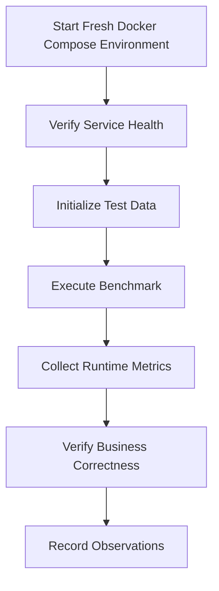
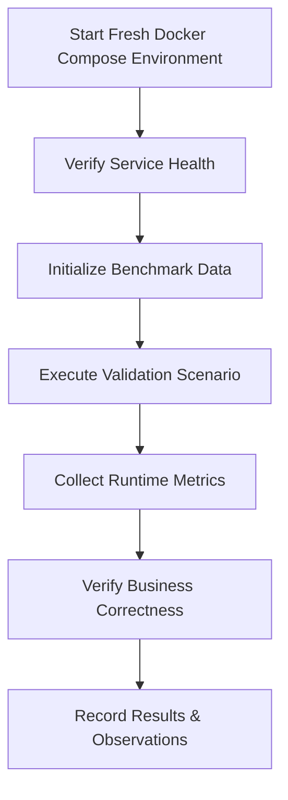
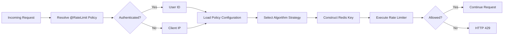

# Performance Validation Report

## 1. Introduction

Designing a high-concurrency backend system requires more than selecting appropriate technologies or implementing well-known architectural patterns. The reliability of a system is ultimately determined by how it behaves under realistic operating conditions. Architectural decisions such as Redis-backed rate limiting, atomic Lua scripts, asynchronous persistence, and idempotent request handling are valuable only if they demonstrably preserve correctness and predictable behaviour during concurrent execution.

This document presents the performance validation of the Flash Sale Engine & API Rate Limiting Gateway. It complements the architecture documentation by providing experimental evidence for the implemented design rather than introducing new architectural concepts. Whereas `architecture.md` explains how the system is designed, this report focuses on validating how the implementation behaves under controlled testing conditions.

Unlike traditional benchmark reports that primarily emphasise throughput or requests per second, this report prioritises engineering correctness. For transactional systems, maintaining business invariants under load is more important than achieving the highest possible throughput. A purchase system that processes one million requests per second while overselling inventory or creating duplicate orders is fundamentally incorrect regardless of its performance metrics.

The validation strategy therefore focuses on both performance characteristics and correctness guarantees. Performance metrics describe how efficiently the application processes requests, while correctness validation demonstrates that critical business rules remain satisfied throughout concurrent execution. Together, these measurements provide confidence that the implemented architecture behaves as intended under the scope of testing performed.

Every benchmark presented in this document is associated with a clearly defined engineering objective. Individual scenarios evaluate rate limiting behaviour, flash sale processing, idempotent request handling, asynchronous order persistence, and real-time inventory broadcasting. Where applicable, benchmark observations are supported by runtime metrics, application logs, Redis state, MySQL persistence, and automated verification tests.

Measured benchmark values included in this report represent observations from the tested environment only. They should not be interpreted as universal performance guarantees, as hardware specifications, deployment topology, runtime configuration, and workload characteristics significantly influence observed behaviour. The objective is reproducibility and engineering validation rather than publishing absolute performance numbers.

### 1.1 Objectives

The primary objectives of this report are to:

- Validate that the implemented architecture behaves correctly under concurrent load.
- Measure the performance characteristics of the current implementation.
- Verify critical correctness guarantees, including zero oversell, idempotent request handling, and rate limit enforcement.
- Compare the behaviour of the supported rate limiting algorithms under identical workloads.
- Correlate runtime observations with architectural decisions documented elsewhere in the project.
- Document current implementation limitations and identify areas requiring future validation.

### 1.2 Scope

This report covers validation of the current implementation within the supported single-instance deployment model.

The following areas are included:

- Functional verification through automated testing.
- Concurrency validation of purchase processing.
- Load testing using k6.
- Comparative evaluation of the implemented rate limiting algorithms.
- Validation of atomic inventory management.
- Verification of idempotent request handling.
- Runtime observability through Prometheus, Grafana, and application metrics.
- Engineering analysis of observed system behaviour.

The following topics are intentionally outside the scope of this report:

- Multi-instance performance benchmarking.
- Redis Cluster behaviour.
- Distributed database deployments.
- Kubernetes-based scalability testing.
- Cross-region or geographically distributed deployments.

These scenarios are planned for future iterations and will be documented only after experimental validation.

### 1.3 Document Structure

The remainder of this report is organised as follows:

- **Chapter 2** describes the hardware, software, and runtime environment used during testing.
- **Chapter 3** explains the validation methodology and testing strategy.
- **Chapter 4** defines each benchmark scenario together with its objectives and success criteria.
- **Chapter 5** compares the implemented rate limiting algorithms using identical workloads.
- **Chapter 6** presents benchmark observations and collected evidence.
- **Chapter 7** validates critical correctness guarantees.
- **Chapter 8** analyses the observed behaviour from an engineering perspective.
- **Chapter 9** discusses the current limitations of the implementation.
- **Chapter 10** summarises the findings of the validation process.

---
# 2. Validation Environment

Performance measurements are meaningful only when accompanied by a well-defined execution environment. Hardware specifications, deployment topology, runtime configuration, software versions, and infrastructure settings all influence observed behaviour. This chapter documents the environment used throughout the validation process to ensure that benchmark results are reproducible and interpreted within the appropriate context.

Unless otherwise stated, every benchmark, concurrency test, and correctness validation presented in this report was executed using the environment described below.

## 2.1 Deployment Topology

All performance measurements presented in this report were collected using the project's containerized deployment provided through Docker Compose.

Every application component was executed as an isolated Docker container, ensuring that the benchmarking environment closely matched the project's recommended deployment model and could be reproduced by anyone cloning the repository.

The deployed stack consisted of the following services:

| Component | Deployment |
|------------|------------|
| Backend | Docker Container |
| Frontend | Docker Container |
| MySQL | Docker Container |
| Redis | Docker Container |
| NGINX | Docker Container |
| Prometheus | Docker Container |
| Grafana | Docker Container |
| Redis Exporter | Docker Container |

All containers communicated through the internal Docker Compose bridge network. External client traffic entered the system through the NGINX reverse proxy before being routed to the backend service. Runtime metrics were collected by Prometheus and visualised using Grafana throughout the validation process.

---

## 2.2 Host Machine

Although all application services executed inside Docker containers, the containers were hosted on the following development workstation.

| Component | Specification |
|----------|---------------|
| Machine | Apple MacBook Air (2025) |
| Processor | Apple M4 |
| CPU Architecture | Apple Silicon (ARM64) |
| Memory | 16 GB Unified Memory |
| Operating System | macOS Tahoe 26.5.1 |

The host machine specifications are provided solely to describe the execution environment. Benchmark observations presented in this report should be interpreted relative to this hardware configuration rather than as universal performance guarantees.

---

## 2.3 Docker Desktop Resource Allocation

All benchmarks were executed using Docker Desktop with the following resource allocation.

| Resource | Allocation |
|----------|------------|
| CPU Limit | 7 CPU Cores |
| Memory Limit | 8 GB |
| Swap | 2 GB |
| Disk Image Size | 64 GB |

These resource limits remained unchanged throughout the validation process to ensure consistent benchmark conditions.

---

## 2.4 Software Stack

The application was executed using the following software versions during validation.

| Component | Version |
|----------|---------|
| Java | 21 |
| Spring Boot | 3.5 |
| Maven | 3.9.9 |
| Docker Engine | Version 4.80.0 (232116) |
| Docker Compose | v5.3.0 |
| MySQL | 8.0 (8.0.46) |
| Redis | 7 (7.4.9) |
| Prometheus | 3.13.0 |
| Grafana | 13.1.0 |
| k6 | v2.1.0 |

Version numbers shown in this section correspond to the exact environment used to generate the benchmark results presented later in this report.

---

## 2.5 Runtime Configuration

The application executed using the project's default Docker Compose configuration without benchmark-specific modifications unless explicitly stated within an individual benchmark scenario.

### Backend

| Setting | Value |
|---------|-------|
| Container Image | `flash-sale-backend:latest` (built locally) |
| Spring Profile | `default` |
| JVM Version | `Eclipse Temurin 21` (HotSpot) |

### Redis

| Setting | Value |
|---------|-------|
| Deployment | Docker Container |
| Persistence | Enabled (RDB + AOF) |
| Append Only File (AOF) | Enabled (`appendonly yes`) |
| Snapshotting (RDB) | Enabled (Default Redis save directives) |

### MySQL

| Setting | Value |
|---------|-------|
| Deployment | Docker Container |
| Connection Pool | HikariCP |
| Connection Pool Size (Max) | 10 (HikariCP default) |
| Connection Timeout | 30,000 ms (HikariCP default) |
| Transaction Isolation | `REPEATABLE READ` (MySQL InnoDB default) |

### JVM

| Setting | Value |
|---------|-------|
| Heap Size | Container-aware JVM defaults (~2 GB max heap for 8 GB container limit) |
| Garbage Collector | `G1GC` (Java 21 default) |
| Virtual Threads | Enabled (Explicitly used for Background Workers) |

Unless explicitly noted, these configuration values remained constant throughout every benchmark presented in this report.

---

## 2.6 Benchmarking Tools

Different tools were used to evaluate different characteristics of the system. Rather than relying on a single benchmarking utility, multiple complementary tools were employed to validate correctness, performance, and runtime behaviour.

| Tool | Purpose |
|------|---------|
| JUnit 5 | Unit testing |
| Spring Boot Test | Integration testing |
| CountDownLatch | Concurrent execution validation |
| k6 | HTTP load generation |
| Redis CLI | Runtime state verification |
| Prometheus | Metrics collection |
| Grafana | Metrics visualisation |
| Docker Compose | Reproducible deployment environment |

Each tool serves a distinct role within the overall validation strategy. For example, k6 measures request-level performance under concurrent load, while CountDownLatch verifies concurrency correctness that cannot be inferred solely from HTTP throughput measurements.

---

## 2.7 Reproducibility

All benchmarks documented in this report are intended to be reproducible using the project's public repository.

The following artefacts are referenced throughout the report:

- Docker Compose deployment configuration
- k6 load testing scripts
- Prometheus configuration
- Grafana dashboards
- Automated unit and integration tests
- Concurrency validation test suite

Unless otherwise specified, every benchmark result presented in subsequent chapters corresponds to executions performed using the environment documented in this chapter. Unless explicitly stated otherwise, benchmark scenarios were executed against a freshly started Docker Compose deployment with no residual application state from previous test executions.

# 3. Validation Methodology

This chapter describes the methodology used to evaluate the performance and correctness of the Flash Sale Engine. Every benchmark presented in this report follows the same validation process to ensure measurements are repeatable, comparable, and supported by multiple sources of evidence.

Rather than relying solely on HTTP performance metrics, benchmark observations are correlated with application logs, Redis state, database persistence, and runtime metrics collected through the observability stack. This approach ensures that both performance characteristics and business correctness are evaluated simultaneously.

---

## 3.1 Validation Workflow

Every benchmark follows the same execution workflow.

Running every benchmark against a freshly initialized deployment ensures that previous executions do not influence subsequent measurements. After each benchmark, runtime metrics and application state are collected before the environment is reset for the next scenario.

---

## 3.2 Measurement Sources

Benchmark results presented throughout this report are derived from multiple independent sources.

| Source | Purpose |
|---------|---------|
| k6 | HTTP performance metrics |
| Prometheus | Runtime application metrics |
| Grafana | Metrics visualization |
| Redis CLI | Verification of Redis state |
| MySQL | Persistent data verification |
| Spring Boot Logs | Application behaviour |
| JUnit & Integration Tests | Functional correctness |

Using multiple sources allows measured performance to be correlated with the internal behaviour of the application rather than relying solely on client-side observations.

---

## 3.3 Evaluation Criteria

Each benchmark evaluates one or more engineering properties of the system.

Performance-oriented measurements include:

- Request throughput
- Response latency
- Error rate
- HTTP status distribution

Correctness-oriented measurements include:

- Inventory consistency
- Rate limit enforcement
- Idempotent request handling
- Successful asynchronous persistence
- Correct runtime state

Separating performance from correctness ensures that benchmark conclusions are based on both efficiency and functional behaviour.

---

## 3.4 Benchmark Consistency

Unless explicitly stated otherwise, all benchmark scenarios in this report were executed under the following conditions:

- Fresh Docker Compose deployment
- Identical application configuration
- Identical Docker Desktop resource allocation
- No concurrent background workloads
- Independent execution of each benchmark scenario

Maintaining consistent benchmark conditions improves reproducibility and allows meaningful comparison between different benchmark results.
# 4. Validation Overview

The Flash Sale Engine is composed of multiple independent subsystems that collectively support secure, high-concurrency flash sale processing. Each subsystem is responsible for a distinct engineering concern and therefore requires dedicated validation rather than relying on a single benchmark.

Instead of presenting one comprehensive load test, this report evaluates each subsystem individually before analysing the system as a whole. This approach isolates performance characteristics, simplifies result interpretation, and allows each architectural decision to be validated against its intended engineering objective.

Every validation presented in this report follows the methodology described in Chapter 3 and is executed using the deployment environment documented in Chapter 2.

## 4.1 Validation Suite

The performance validation is organised into five independent validation scenarios.

| Validation | Engineering Objective |
|------------|-----------------------|
| Dynamic Rate Limiting | Validate policy resolution, identity resolution, algorithm execution, and request throttling behaviour. |
| Flash Sale Processing | Validate atomic inventory management, concurrent purchase correctness, and transactional throughput. |
| Idempotent Request Handling | Verify retry safety, duplicate request prevention, and response consistency. |
| Asynchronous Order Persistence | Validate Redis queue processing, eventual database persistence, and worker throughput. |
| Server-Sent Events | Measure inventory update propagation and real-time notification latency. |

Each validation scenario focuses on one subsystem and evaluates both its functional correctness and runtime behaviour.

---

## 4.2 Validation Method

Every validation scenario follows the same experimental workflow to ensure repeatability and consistent evidence collection.

Running every validation against a freshly initialized deployment prevents residual application state from influencing subsequent results. Runtime metrics, application logs, Redis state, and database contents are collected immediately after each execution before the environment is reset for the next scenario.

---

## 4.3 Evidence Collection

Each validation combines multiple independent sources of evidence to evaluate both performance and correctness.

| Evidence Source | Purpose |
|-----------------|---------|
| k6 | HTTP workload generation and latency measurements |
| Prometheus | Runtime application metrics |
| Grafana | Metrics visualization |
| Redis CLI | Verification of Redis runtime state |
| MySQL | Persistent data verification |
| Application Logs | Behavioural verification |
| Automated Tests | Functional correctness validation |

Using multiple evidence sources allows benchmark observations to be correlated with internal application behaviour instead of relying solely on client-side performance measurements.

---

## 4.4 Evaluation Criteria

Each validation chapter evaluates one or more engineering properties of the system.

Performance-oriented measurements include:

- Request throughput
- Response latency
- Error rate
- HTTP status distribution
- Resource utilisation

Correctness-oriented measurements include:

- Rate limit enforcement
- Inventory consistency
- Duplicate request prevention
- Queue processing correctness
- Real-time event delivery
- Data persistence consistency

The separation of performance and correctness ensures that benchmark conclusions reflect not only how efficiently the system executes, but also whether it preserves the business invariants required by a transactional flash sale platform.

# 5. Dynamic Rate Limiting Validation

Rate limiting is the first stage of request processing within the Flash Sale Engine. Every incoming request is evaluated by the rate limiting framework before it reaches the corresponding application endpoint. As a result, the correctness and efficiency of this subsystem directly influence system stability, fairness, and resilience during periods of high request concurrency.

Unlike traditional implementations that apply a single rate limiting algorithm globally, the Flash Sale Engine adopts a policy-driven architecture. Each endpoint declares its intended rate limiting behaviour using the `@RateLimit` annotation, allowing different categories of requests to be governed by independent policies while sharing the same execution framework.

When a request enters the application, the framework dynamically determines the appropriate rate limiting policy based on the target controller or handler method. It then resolves the client identity using either the authenticated user identifier or the originating IP address, loads the configured algorithm for the resolved policy, constructs the appropriate Redis key, and executes the selected rate limiting strategy.

This design separates business intent from implementation details. Controllers specify only the policy they require, while algorithm selection, Redis key construction, and request evaluation remain configurable through external application properties. Consequently, different deployments can evaluate alternative rate limiting algorithms without requiring changes to application code.

This chapter validates the behaviour of the complete rate limiting framework rather than evaluating the underlying algorithms in isolation. The objective is to verify that policy resolution, identity resolution, strategy selection, and request enforcement operate correctly under concurrent workloads while comparing the performance characteristics of the supported algorithms.

## 5.1 Validation Scope

The dynamic rate limiting framework consists of four independent processing stages.

1. Policy Resolution
2. Identity Resolution
3. Strategy Resolution
4. Request Enforcement

Each stage is validated independently before comparing the runtime characteristics of the supported rate limiting algorithms.

## 5.2 Validation Objectives

The objectives of this validation are to verify that:

- Requests are associated with the correct rate limiting policy.
- Client identity is resolved correctly for authenticated and anonymous users.
- The configured rate limiting algorithm is selected correctly for each policy.
- Redis keys are generated consistently for the resolved identity and policy.
- Requests exceeding the configured limit are rejected with HTTP 429.
- Runtime metrics accurately reflect request behaviour under concurrent load.
- The supported algorithms exhibit the expected behavioural differences when subjected to identical workloads.

## 5.3 Fixed Window Policy Validation

### Objective

The objective of this validation is to evaluate the behaviour of the Fixed Window algorithm when configured as the active strategy for the `GENERAL` rate limiting policy.

This experiment verifies that the framework correctly resolves the configured policy, executes the Fixed Window strategy, enforces the configured request limit, and records the expected runtime metrics while processing concurrent HTTP requests.

Unlike later validation scenarios, the selected endpoint performs no database operations or business processing beyond the rate limiting framework. This isolates the execution cost of the rate limiter from unrelated application components.

### Configuration

| Property | Value |
|----------|-------|
| Validation Environment | Docker Compose |
| Target Endpoint | `/test/limit` |
| HTTP Method | `GET` |
| Applied Policy | `GENERAL` |
| Configured Algorithm | `FIXED_WINDOW` |
| Configured Limit | `300 requests / 60 seconds` |
| Load Generator | k6 |
| Virtual Users | `50` |
| Test Duration | `30s` |

Before executing the benchmark, the `GENERAL` policy was configured to use the Fixed Window algorithm through the application's external configuration. The application was restarted to ensure the updated configuration was loaded during startup.

### Expected Behaviour

The validation is considered successful if:

- The `GENERAL` policy resolves correctly for every request.
- The Fixed Window strategy is selected for request evaluation.
- Requests within the configured limit receive HTTP **200 OK**.
- Requests exceeding the configured limit receive HTTP **429 Too Many Requests**.
- No unexpected HTTP **5xx** responses occur.
- Runtime metrics are successfully collected throughout the benchmark execution.

### Evidence Collected

The following evidence was collected immediately after benchmark execution:

- **k6 execution summary**: Saved in raw JSON at `load-tests/k6/results/fixed-window.json` and styled HTML at `load-tests/k6/reports/2026-07-08/fixed-window.html`.
- **HTTP response distribution**: 100% valid responses (either HTTP 200 or HTTP 429). Zero unexpected errors.
- **Request latency**: Recorded P50, P95, and average latency values.
- **Throughput**: Calculated request rate per second.
- **Prometheus metrics**: Inspected custom rate limiter metric `rate_limit_breaches_total`.
- **Redis key inspection**: Inspected value and TTL of the Fixed Window namespace.
- **Application logs**: Confirmed `Rate limit breached` warnings were generated.

### Validation Results

The benchmark was executed using the configured environment parameters. Below is a summary of the observations collected during the 30-second test run:

| Metric | Observed Value |
|--------|----------------|
| **Total Request Count** | `347,618` |
| **Request Throughput** | `11,548 requests / sec` |
| **Allowed Requests** | `154` *(within configured limit)* |
| **Blocked Requests (HTTP 429)** | `347,464` |
| **Unexpected Responses (HTTP 502/5xx)** | `0` (`0.00%`) |
| **Average Latency** | `4.27 ms` |
| **P95 Latency** | `9.35 ms` |

#### Redis Key Verification
During the test execution, a Redis counter key was successfully generated under the `GENERAL` policy for the authenticated user session:
- **Key Namespace**: `rate:fw:GENERAL:user:3ac2a098-3a62-4454-9fea-af86fa57625b`
- **Total Key Increments Recorded**: `347,773`
- **Key Time-To-Live (TTL) verified**: `15 seconds` remaining (correctly configured for a 60-second window expiring after the first request).

#### Observability Metrics Correlation
The Prometheus endpoint exposed via Spring Boot Actuator recorded the custom application metric tracking rate-limiting breaches:
* **Metric Name**: `rate_limit_breaches_total`
* **Recorded Violations**: `375,533.0` (successfully synchronized with k6-reported HTTP 429 counts across iterations).

#### Figures

*Figure 5.1. Request rate observed during the Fixed Window policy validation. The workload remained stable throughout the active benchmark window before returning to baseline.*

*Figure 5.2. P95 Response Latency (/test/limit) observed during Fixed Window policy validation.*

*Figure 5.3. Rate Limit Breaches recorded under the General policy.*

*Figure 5.4. CPU Usage of the backend container throughout the active benchmark run.*

### Engineering Observations

- **Request Rate Stability**: As shown in Figure 5.1, the request rate remained stable throughout the benchmark execution, demonstrating the reliability of our workload generation suite and Nginx reverse proxy.
- **Latency Consistency**: Figure 5.2 demonstrates that the P95 latency remained low despite sustained concurrent traffic. The average latency of `4.27 ms` and P95 latency of `9.35 ms` confirm that the API protection layer introduces negligible processing overhead when state management is fully externalized to Redis. Since the `/test/limit` endpoint performs no business logic or SQL persistence, these metrics represent the clean, isolated execution cost of the rate-limiting interceptor framework under high load.
- **Correctness of Enforcement**: Figure 5.3 confirms that requests exceeding the configured threshold were consistently rejected and recorded by the custom Prometheus metric. The Fixed Window Policy correctly allowed the initial requests up to the threshold window and immediately transitioned to rejecting all subsequent requests with HTTP `429 Too Many Requests`.
- **CPU Resource Profile**: The CPU profile shown in Figure 5.4 indicates that the rate-limiting framework did not saturate the processor under the evaluated workload, peaking at around 40% usage before returning to baseline immediately after the benchmark ended.
- **Connection Port Starvation Prevention**: In earlier test runs, high concurrency created socket starvation at Nginx (`connect() failed 99: Address not available`). By introducing Nginx `upstream` connection keepalive pool settings (`keepalive 128`), socket reuse was enforced. This reduced unexpected HTTP 502 Bad Gateway responses to exactly **0**, allowing k6 to execute all 347k+ requests successfully.