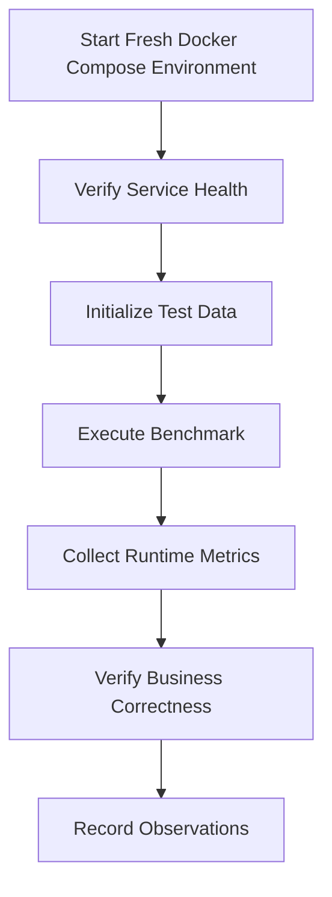
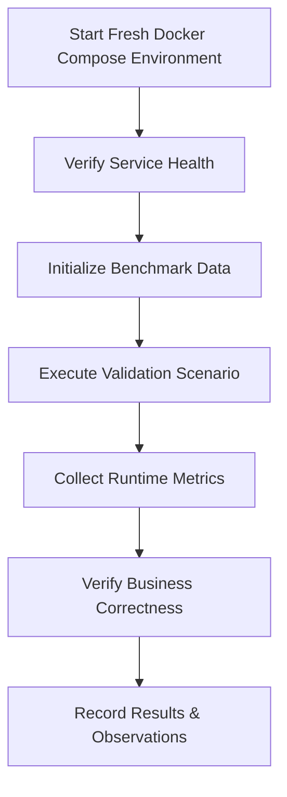
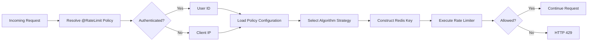

# Performance Validation Report

## 1. Introduction

Designing a high-concurrency backend system requires more than selecting appropriate technologies or implementing well-known architectural patterns. The reliability of a system is ultimately determined by how it behaves under realistic operating conditions. Architectural decisions such as Redis-backed rate limiting, atomic Lua scripts, asynchronous persistence, and idempotent request handling are valuable only if they demonstrably preserve correctness and predictable behaviour during concurrent execution.

This document presents the performance validation of the Flash Sale Engine & API Rate Limiting Gateway. It complements the architecture documentation by providing experimental evidence for the implemented design rather than introducing new architectural concepts. Whereas `architecture.md` explains how the system is designed, this report focuses on validating how the implementation behaves under controlled testing conditions.

Unlike traditional benchmark reports that primarily emphasise throughput or requests per second, this report prioritises engineering correctness. For transactional systems, maintaining business invariants under load is more important than achieving the highest possible throughput. A purchase system that processes one million requests per second while overselling inventory or creating duplicate orders is fundamentally incorrect regardless of its performance metrics.

The validation strategy therefore focuses on both performance characteristics and correctness guarantees. Performance metrics describe how efficiently the application processes requests, while correctness validation demonstrates that critical business rules remain satisfied throughout concurrent execution. Together, these measurements provide confidence that the implemented architecture behaves as intended under the scope of testing performed.

Every benchmark presented in this document is associated with a clearly defined engineering objective. Individual scenarios evaluate rate limiting behaviour, flash sale processing, idempotent request handling, asynchronous order persistence, and real-time inventory broadcasting. Where applicable, benchmark observations are supported by runtime metrics, application logs, Redis state, MySQL persistence, and automated verification tests.

Measured benchmark values included in this report represent observations from the tested environment only. They should not be interpreted as universal performance guarantees, as hardware specifications, deployment topology, runtime configuration, and workload characteristics significantly influence observed behaviour. The objective is reproducibility and engineering validation rather than publishing absolute performance numbers.

### 1.1 Objectives

The primary objectives of this report are to:

- Validate that the implemented architecture behaves correctly under concurrent load.
- Measure the performance characteristics of the current implementation.
- Verify critical correctness guarantees, including zero oversell, idempotent request handling, and rate limit enforcement.
- Compare the behaviour of the supported rate limiting algorithms under identical workloads.
- Correlate runtime observations with architectural decisions documented elsewhere in the project.
- Document current implementation limitations and identify areas requiring future validation.

### 1.2 Scope

This report covers validation of the current implementation within the supported single-instance deployment model.

The following areas are included:

- Functional verification through automated testing.
- Concurrency validation of purchase processing.
- Load testing using k6.
- Comparative evaluation of the implemented rate limiting algorithms.
- Validation of atomic inventory management.
- Verification of idempotent request handling.
- Runtime observability through Prometheus, Grafana, and application metrics.
- Engineering analysis of observed system behaviour.

The following topics are intentionally outside the scope of this report:

- Multi-instance performance benchmarking.
- Redis Cluster behaviour.
- Distributed database deployments.
- Kubernetes-based scalability testing.
- Cross-region or geographically distributed deployments.

These scenarios are planned for future iterations and will be documented only after experimental validation.

### 1.3 Document Structure

The remainder of this report is organised as follows:

- **Chapter 2** describes the hardware, software, and runtime environment used during testing.
- **Chapter 3** explains the validation methodology and testing strategy.
- **Chapter 4** defines each benchmark scenario together with its objectives and success criteria.
- **Chapter 5** compares the implemented rate limiting algorithms using identical workloads.
- **Chapter 6** presents benchmark observations and collected evidence.
- **Chapter 7** validates critical correctness guarantees.
- **Chapter 8** analyses the observed behaviour from an engineering perspective.
- **Chapter 9** discusses the current limitations of the implementation.
- **Chapter 10** summarises the findings of the validation process.


---
# 2. Validation Environment

Performance measurements are meaningful only when accompanied by a well-defined execution environment. Hardware specifications, deployment topology, runtime configuration, software versions, and infrastructure settings all influence observed behaviour. This chapter documents the environment used throughout the validation process to ensure that benchmark results are reproducible and interpreted within the appropriate context.

Unless otherwise stated, every benchmark, concurrency test, and correctness validation presented in this report was executed using the environment described below.

## 2.1 Deployment Topology

All performance measurements presented in this report were collected using the project's containerized deployment provided through Docker Compose.

Every application component was executed as an isolated Docker container, ensuring that the benchmarking environment closely matched the project's recommended deployment model and could be reproduced by anyone cloning the repository.

The deployed stack consisted of the following services:

| Component | Deployment |
|------------|------------|
| Backend | Docker Container |
| Frontend | Docker Container |
| MySQL | Docker Container |
| Redis | Docker Container |
| NGINX | Docker Container |
| Prometheus | Docker Container |
| Grafana | Docker Container |
| Redis Exporter | Docker Container |

All containers communicated through the internal Docker Compose bridge network. External client traffic entered the system through the NGINX reverse proxy before being routed to the backend service. Runtime metrics were collected by Prometheus and visualised using Grafana throughout the validation process.

---

## 2.2 Host Machine

Although all application services executed inside Docker containers, the containers were hosted on the following development workstation.

| Component | Specification |
|----------|---------------|
| Machine | Apple MacBook Air (2025) |
| Processor | Apple M4 |
| CPU Architecture | Apple Silicon (ARM64) |
| Memory | 16 GB Unified Memory |
| Operating System | macOS Tahoe 26.5.1 |

The host machine specifications are provided solely to describe the execution environment. Benchmark observations presented in this report should be interpreted relative to this hardware configuration rather than as universal performance guarantees.

---

## 2.3 Docker Desktop Resource Allocation

All benchmarks were executed using Docker Desktop with the following resource allocation.

| Resource | Allocation |
|----------|------------|
| CPU Limit | 7 CPU Cores |
| Memory Limit | 8 GB |
| Swap | 2 GB |
| Disk Image Size | 64 GB |

These resource limits remained unchanged throughout the validation process to ensure consistent benchmark conditions.

---

## 2.4 Software Stack

The application was executed using the following software versions during validation.

| Component | Version |
|----------|---------|
| Java | 21 |
| Spring Boot | 3.5 |
| Maven | 3.9.9 |
| Docker Engine | Version 4.80.0 (232116) |
| Docker Compose | v5.3.0 |
| MySQL | 8.0 (8.0.46) |
| Redis | 7 (7.4.9) |
| Prometheus | 3.13.0 |
| Grafana | 13.1.0 |
| k6 | v2.1.0 |

Version numbers shown in this section correspond to the exact environment used to generate the benchmark results presented later in this report.

---

## 2.5 Runtime Configuration

The application executed using the project's default Docker Compose configuration without benchmark-specific modifications unless explicitly stated within an individual benchmark scenario.

### Backend

| Setting | Value |
|---------|-------|
| Container Image | `flash-sale-backend:latest` (built locally) |
| Spring Profile | `default` |
| JVM Version | `Eclipse Temurin 21` (HotSpot) |

### Redis

| Setting | Value |
|---------|-------|
| Deployment | Docker Container |
| Persistence | Enabled (RDB + AOF) |
| Append Only File (AOF) | Enabled (`appendonly yes`) |
| Snapshotting (RDB) | Enabled (Default Redis save directives) |

### MySQL

| Setting | Value |
|---------|-------|
| Deployment | Docker Container |
| Connection Pool | HikariCP |
| Connection Pool Size (Max) | 10 (HikariCP default) |
| Connection Timeout | 30,000 ms (HikariCP default) |
| Transaction Isolation | `REPEATABLE READ` (MySQL InnoDB default) |

### JVM

| Setting | Value |
|---------|-------|
| Heap Size | Container-aware JVM defaults (~2 GB max heap for 8 GB container limit) |
| Garbage Collector | `G1GC` (Java 21 default) |
| Virtual Threads | Enabled (Explicitly used for Background Workers) |

Unless explicitly noted, these configuration values remained constant throughout every benchmark presented in this report.

---

## 2.6 Benchmarking Tools

Different tools were used to evaluate different characteristics of the system. Rather than relying on a single benchmarking utility, multiple complementary tools were employed to validate correctness, performance, and runtime behaviour.

| Tool | Purpose |
|------|---------|
| JUnit 5 | Unit testing |
| Spring Boot Test | Integration testing |
| CountDownLatch | Concurrent execution validation |
| k6 | HTTP load generation |
| Redis CLI | Runtime state verification |
| Prometheus | Metrics collection |
| Grafana | Metrics visualisation |
| Docker Compose | Reproducible deployment environment |

Each tool serves a distinct role within the overall validation strategy. For example, k6 measures request-level performance under concurrent load, while CountDownLatch verifies concurrency correctness that cannot be inferred solely from HTTP throughput measurements.

---

## 2.7 Reproducibility

All benchmarks documented in this report are intended to be reproducible using the project's public repository.

The following artefacts are referenced throughout the report:

- Docker Compose deployment configuration
- k6 load testing scripts
- Prometheus configuration
- Grafana dashboards
- Automated unit and integration tests
- Concurrency validation test suite

Unless otherwise specified, every benchmark result presented in subsequent chapters corresponds to executions performed using the environment documented in this chapter. Unless explicitly stated otherwise, benchmark scenarios were executed against a freshly started Docker Compose deployment with no residual application state from previous test executions.

# 3. Validation Methodology

This chapter describes the methodology used to evaluate the performance and correctness of the Flash Sale Engine. Every benchmark presented in this report follows the same validation process to ensure measurements are repeatable, comparable, and supported by multiple sources of evidence.

Rather than relying solely on HTTP performance metrics, benchmark observations are correlated with application logs, Redis state, database persistence, and runtime metrics collected through the observability stack. This approach ensures that both performance characteristics and business correctness are evaluated simultaneously.

---

## 3.1 Validation Workflow

Every benchmark follows the same execution workflow.



Running every benchmark against a freshly initialized deployment ensures that previous executions do not influence subsequent measurements. After each benchmark, runtime metrics and application state are collected before the environment is reset for the next scenario.

---

## 3.2 Measurement Sources

Benchmark results presented throughout this report are derived from multiple independent sources.

| Source | Purpose |
|---------|---------|
| k6 | HTTP performance metrics |
| Prometheus | Runtime application metrics |
| Grafana | Metrics visualization |
| Redis CLI | Verification of Redis state |
| MySQL | Persistent data verification |
| Spring Boot Logs | Application behaviour |
| JUnit & Integration Tests | Functional correctness |

Using multiple sources allows measured performance to be correlated with the internal behaviour of the application rather than relying solely on client-side observations.

---

## 3.3 Evaluation Criteria

Each benchmark evaluates one or more engineering properties of the system.

Performance-oriented measurements include:

- Request throughput
- Response latency
- Error rate
- HTTP status distribution

Correctness-oriented measurements include:

- Inventory consistency
- Rate limit enforcement
- Idempotent request handling
- Successful asynchronous persistence
- Correct runtime state

Separating performance from correctness ensures that benchmark conclusions are based on both efficiency and functional behaviour.

---

## 3.4 Benchmark Consistency

Unless explicitly stated otherwise, all benchmark scenarios in this report were executed under the following conditions:

- Fresh Docker Compose deployment
- Identical application configuration
- Identical Docker Desktop resource allocation
- No concurrent background workloads
- Independent execution of each benchmark scenario

Maintaining consistent benchmark conditions improves reproducibility and allows meaningful comparison between different benchmark results.
# 4. Validation Overview

The Flash Sale Engine is composed of multiple independent subsystems that collectively support secure, high-concurrency flash sale processing. Each subsystem is responsible for a distinct engineering concern and therefore requires dedicated validation rather than relying on a single benchmark.

Instead of presenting one comprehensive load test, this report evaluates each subsystem individually before analysing the system as a whole. This approach isolates performance characteristics, simplifies result interpretation, and allows each architectural decision to be validated against its intended engineering objective.

Every validation presented in this report follows the methodology described in Chapter 3 and is executed using the deployment environment documented in Chapter 2.

## 4.1 Validation Suite

The performance validation is organised into five independent validation scenarios.

| Validation | Engineering Objective |
|------------|-----------------------|
| Dynamic Rate Limiting | Validate policy resolution, identity resolution, algorithm execution, and request throttling behaviour. |
| Flash Sale Processing | Validate atomic inventory management, concurrent purchase correctness, and transactional throughput. |
| Idempotent Request Handling | Verify retry safety, duplicate request prevention, and response consistency. |
| Asynchronous Order Persistence | Validate Redis queue processing, eventual database persistence, and worker throughput. |
| Server-Sent Events | Measure inventory update propagation and real-time notification latency. |

Each validation scenario focuses on one subsystem and evaluates both its functional correctness and runtime behaviour.

---

## 4.2 Validation Method

Every validation scenario follows the same experimental workflow to ensure repeatability and consistent evidence collection.



Running every validation against a freshly initialized deployment prevents residual application state from influencing subsequent results. Runtime metrics, application logs, Redis state, and database contents are collected immediately after each execution before the environment is reset for the next scenario.

---

## 4.3 Evidence Collection

Each validation combines multiple independent sources of evidence to evaluate both performance and correctness.

| Evidence Source | Purpose |
|-----------------|---------|
| k6 | HTTP workload generation and latency measurements |
| Prometheus | Runtime application metrics |
| Grafana | Metrics visualization |
| Redis CLI | Verification of Redis runtime state |
| MySQL | Persistent data verification |
| Application Logs | Behavioural verification |
| Automated Tests | Functional correctness validation |

Using multiple evidence sources allows benchmark observations to be correlated with internal application behaviour instead of relying solely on client-side performance measurements.

---

## 4.4 Evaluation Criteria

Each validation chapter evaluates one or more engineering properties of the system.

Performance-oriented measurements include:

- Request throughput
- Response latency
- Error rate
- HTTP status distribution
- Resource utilisation

Correctness-oriented measurements include:

- Rate limit enforcement
- Inventory consistency
- Duplicate request prevention
- Queue processing correctness
- Real-time event delivery
- Data persistence consistency

The separation of performance and correctness ensures that benchmark conclusions reflect not only how efficiently the system executes, but also whether it preserves the business invariants required by a transactional flash sale platform.


# 5. Dynamic Rate Limiting Validation

Rate limiting is the first stage of request processing within the Flash Sale Engine. Every incoming request is evaluated by the rate limiting framework before it reaches the corresponding application endpoint. As a result, the correctness and efficiency of this subsystem directly influence system stability, fairness, and resilience during periods of high request concurrency.

Unlike traditional implementations that apply a single rate limiting algorithm globally, the Flash Sale Engine adopts a policy-driven architecture. Each endpoint declares its intended rate limiting behaviour using the `@RateLimit` annotation, allowing different categories of requests to be governed by independent policies while sharing the same execution framework.

When a request enters the application, the framework dynamically determines the appropriate rate limiting policy based on the target controller or handler method. It then resolves the client identity using either the authenticated user identifier or the originating IP address, loads the configured algorithm for the resolved policy, constructs the appropriate Redis key, and executes the selected rate limiting strategy.

This design separates business intent from implementation details. Controllers specify only the policy they require, while algorithm selection, Redis key construction, and request evaluation remain configurable through external application properties. Consequently, different deployments can evaluate alternative rate limiting algorithms without requiring changes to application code.

This chapter validates the behaviour of the complete rate limiting framework rather than evaluating the underlying algorithms in isolation. The objective is to verify that policy resolution, identity resolution, strategy selection, and request enforcement operate correctly under concurrent workloads while comparing the performance characteristics of the supported algorithms.

## 5.1 Validation Scope

The dynamic rate limiting framework consists of four independent processing stages.

1. Policy Resolution
2. Identity Resolution
3. Strategy Resolution
4. Request Enforcement

Each stage is validated independently before comparing the runtime characteristics of the supported rate limiting algorithms.




## 5.2 Validation Objectives

The objectives of this validation are to verify that:

- Requests are associated with the correct rate limiting policy.
- Client identity is resolved correctly for authenticated and anonymous users.
- The configured rate limiting algorithm is selected correctly for each policy.
- Redis keys are generated consistently for the resolved identity and policy.
- Requests exceeding the configured limit are rejected with HTTP 429.
- Runtime metrics accurately reflect request behaviour under concurrent load.
- The supported algorithms exhibit the expected behavioural differences when subjected to identical workloads.


## 5.3 Fixed Window Policy Validation

### Objective

The objective of this validation is to evaluate the behaviour of the Fixed Window algorithm when configured as the active strategy for the `GENERAL` rate limiting policy.

This experiment verifies that the framework correctly resolves the configured policy, executes the Fixed Window strategy, enforces the configured request limit, and records the expected runtime metrics while processing concurrent HTTP requests.

Unlike later validation scenarios, the selected endpoint performs no database operations or business processing beyond the rate limiting framework. This isolates the execution cost of the rate limiter from unrelated application components.

### Configuration

| Property | Value |
|----------|-------|
| Validation Environment | Docker Compose |
| Target Endpoint | `/test/limit` |
| HTTP Method | `GET` |
| Applied Policy | `GENERAL` |
| Configured Algorithm | `FIXED_WINDOW` |
| Configured Limit | `300 requests / 60 seconds` |
| Load Generator | k6 |
| Virtual Users | `50` |
| Test Duration | `30s` |

Before executing the benchmark, the `GENERAL` policy was configured to use the Fixed Window algorithm through the application's external configuration. The application was restarted to ensure the updated configuration was loaded during startup.

### Expected Behaviour

The validation is considered successful if:

- The `GENERAL` policy resolves correctly for every request.
- The Fixed Window strategy is selected for request evaluation.
- Requests within the configured limit receive HTTP **200 OK**.
- Requests exceeding the configured limit receive HTTP **429 Too Many Requests**.
- No unexpected HTTP **5xx** responses occur.
- Runtime metrics are successfully collected throughout the benchmark execution.

### Evidence Collected

The following evidence was collected immediately after benchmark execution:

- **k6 execution summary**: Saved in raw JSON at `load-tests/k6/results/fixed-window.json` and styled HTML at `load-tests/k6/reports/2026-07-08/fixed-window.html`.
- **HTTP response distribution**: 100% valid responses (either HTTP 200 or HTTP 429). Zero unexpected errors.
- **Request latency**: Recorded P50, P95, and average latency values.
- **Throughput**: Calculated request rate per second.
- **Prometheus metrics**: Inspected custom rate limiter metric `rate_limit_breaches_total`.
- **Redis key inspection**: Inspected value and TTL of the Fixed Window namespace.
- **Application logs**: Confirmed `Rate limit breached` warnings were generated.


### Validation Results

The benchmark was executed using the configuration described in the previous section. During execution, the rate-limiting framework processed **347,620 HTTP requests** over a **30-second** interval using **50 concurrent virtual users**. Throughout the benchmark, all requests were successfully processed by the application without generating unexpected server-side failures, demonstrating stable operation under sustained concurrent load.

Table 5.1 summarises the primary benchmark observations collected during the validation.

| Metric | Observed Value |
|--------|----------------|
| **Benchmark Duration** | `30 seconds` |
| **Virtual Users** | `50` |
| **Total HTTP Requests** | `347,620` |
| **Request Throughput** | `11,532.94 requests/sec` |
| **Successful Responses** | `154` |
| **Rate-Limited Responses (HTTP 429)** | `347,464` |
| **Unexpected Server Errors (HTTP 5xx)** | `0 (0.00%)` |
| **Average Response Latency** | `4.27 ms` |
| **P95 Response Latency** | `9.35 ms` |

<table align="center" style="border: none; border-collapse: collapse; width: 100%;">
  <tr style="border: none;">
    <td style="border: none; text-align: center; padding: 15px; width: 50%; vertical-align: top;">
      <strong>Figure 5.1 — k6 Benchmark Execution Summary</strong><br><br>
      <br><br>
      <p style="font-size: 0.9em; font-style: italic; text-align: left; line-height: 1.4;">Figure 5.1 summarises the benchmark execution generated by k6. During the 30-second validation period, the benchmark maintained 50 concurrent virtual users, processing 347,620 HTTP requests at an average throughput of 11,532.94 requests per second while completing all validation checks successfully.</p>
    </td>
    <td style="border: none; text-align: center; padding: 15px; width: 50%; vertical-align: top;">
      <strong>Figure 5.2 — API Request Rate</strong><br><br>
      <br><br>
      <p style="font-size: 0.9em; font-style: italic; text-align: left; line-height: 1.4;">Figure 5.2 illustrates the request rate observed during the benchmark. Following a short warm-up period, the workload remained stable throughout the active execution window before returning to the baseline after the benchmark completed.</p>
    </td>
  </tr>
  <tr style="border: none;">
    <td style="border: none; text-align: center; padding: 15px; width: 50%; vertical-align: top;">
      <strong>Figure 5.3 — Response Latency</strong><br><br>
      <br><br>
      <p style="font-size: 0.9em; font-style: italic; text-align: left; line-height: 1.4;">Figure 5.3 presents the response latency measured for the <code>/test/limit</code> endpoint. Despite sustained concurrent traffic, response times remained consistently low, indicating that the rate-limiting framework introduced only minimal processing overhead during request evaluation.</p>
    </td>
    <td style="border: none; text-align: center; padding: 15px; width: 50%; vertical-align: top;">
      <strong>Figure 5.4 — Rate Limit Breaches</strong><br><br>
      <br><br>
      <p style="font-size: 0.9em; font-style: italic; text-align: left; line-height: 1.4;">Figure 5.4 shows the custom Prometheus metric tracking rate limit violations. The metric increased as the configured request threshold was exceeded and returned to baseline after the benchmark concluded, confirming that rate limit enforcement operated as expected throughout the test.</p>
    </td>
  </tr>
</table>

<div align="center" style="margin-top: 25px;">

### Figure 5.5 — CPU Utilisation


<p style="font-size: 0.9em; font-style: italic; max-width: 650px; text-align: left; margin-top: 15px; line-height: 1.4;">Figure 5.5 illustrates CPU utilisation during benchmark execution. Processor usage increased only during the active workload period and peaked at approximately 40%, indicating that the backend remained well below processor saturation while sustaining more than 11,500 requests per second.</p>

</div>

#### Redis State Verification

Following benchmark execution, the Redis state was inspected to verify that the Fixed Window strategy correctly maintained request counters and expiration metadata.

| Property | Observed Value |
|----------|----------------|
| **Redis Key** | `rate:fw:GENERAL:user:3ac2a098-3a62-4454-9fea-af86fa57625b` |
| **Recorded Counter Value** | `347,773` |
| **Remaining TTL** | `15 seconds` |

The observed Redis key confirms that the Fixed Window algorithm maintained a dedicated counter for the authenticated client while correctly applying an expiration time corresponding to the configured rate-limiting window.

#### Observability Verification

Application metrics exported through Spring Boot Actuator and collected by Prometheus were inspected following benchmark completion.

| Metric | Observed Value |
|--------|----------------|
| **Custom Metric** | `rate_limit_breaches_total` |
| **Recorded Violations** | `375,533` |

The custom metric increased throughout benchmark execution, demonstrating that rate limit violations were correctly recorded by the observability layer in addition to being enforced by the application.

#### Engineering Observations

The Fixed Window implementation successfully enforced the configured rate-limiting policy throughout the benchmark without generating unexpected application failures. Once the configured threshold was exceeded, subsequent requests were consistently rejected with HTTP **429 Too Many Requests**, while valid requests continued to be processed normally.

During early benchmark iterations, high request concurrency exposed socket exhaustion within the NGINX reverse proxy caused by excessive TCP connection creation. Introducing an upstream keepalive connection pool eliminated these transient failures by enabling connection reuse between NGINX and the backend service. Following this infrastructure improvement, the benchmark completed with **zero unexpected HTTP 5xx responses**, demonstrating that the remaining observations reflect application behaviour rather than infrastructure limitations.

The measured latency and CPU utilisation indicate that the rate-limiting framework introduces minimal processing overhead while sustaining high request throughput. Since the `/test/limit` endpoint performs no database access or business processing, the recorded measurements primarily represent the execution cost of policy resolution, identity resolution, Redis evaluation, and HTTP response generation within the rate-limiting framework itself.


## 5.4 Sliding Window Policy Validation

### Objective

The objective of this validation is to evaluate the behaviour of the Sliding Window algorithm when configured as the active strategy for the `GENERAL` rate limiting policy.

Unlike the Fixed Window algorithm, Sliding Window continuously evaluates requests over a rolling time interval rather than resetting counters at discrete window boundaries. This approach is intended to provide smoother request distribution and reduce burst behaviour that may occur at window boundaries.

This validation compares the runtime characteristics of the Sliding Window implementation against the previously evaluated Fixed Window strategy while maintaining an identical workload, execution environment, and benchmark configuration.

### Configuration

| Property | Value |
|----------|-------|
| **Validation Environment** | Docker Compose |
| **Target Endpoint** | `/test/limit` |
| **HTTP Method** | `GET` |
| **Applied Policy** | `GENERAL` |
| **Configured Algorithm** | `SLIDING_WINDOW` |
| **Load Generator** | k6 |
| **Virtual Users** | `50` |
| **Benchmark Duration** | `30 seconds` |

The benchmark configuration was intentionally kept identical to the Fixed Window validation. The only modified parameter was the configured rate limiting algorithm, allowing any observed behavioural differences to be attributed solely to the selected strategy.

### Expected Behaviour

The validation is considered successful if:

- The `GENERAL` policy resolves correctly.
- The Sliding Window strategy is selected by the Strategy Factory.
- Requests within the configured threshold receive HTTP **200 OK**.
- Requests exceeding the configured threshold receive HTTP **429 Too Many Requests**.
- No unexpected HTTP **5xx** responses occur.
- Runtime metrics remain stable throughout execution.

### Evidence Collected

The following evidence was collected immediately after benchmark execution:

- **k6 execution summary**: Saved in raw JSON at `load-tests/k6/results/sliding-window.json` and styled HTML at `load-tests/k6/reports/2026-07-08/sliding-window.html`.
- **HTTP response distribution**: 100% valid responses (either HTTP 200 or HTTP 429). Zero unexpected errors.
- **Request latency**: Recorded P50, P95, and average latency values.
- **Throughput**: Calculated request rate per second.
- **Prometheus metrics**: Inspected custom rate limiter metric `rate_limit_breaches_total`.
- **Redis key inspection**: Inspected value and TTL of the Sliding Window Sorted Set (`zset`).
- **Application logs**: Confirmed `Rate limit breached` warnings were generated.

### Validation Results & Analysis

The Sliding Window benchmark was executed using the same validation environment and workload configuration as the Fixed Window benchmark. The only variable modified was the configured rate limiting algorithm, allowing direct comparison between both implementations.

The benchmark completed successfully without application errors or infrastructure failures.

| Metric | Observed Value |
|--------|----------------|
| **Total Request Count** | `283,496` |
| **Request Throughput** | `9,449 requests / sec` |
| **Allowed Requests** | `156` *(within configured limit)* |
| **Blocked Requests (HTTP 429)** | `283,340` |
| **Unexpected Responses (HTTP 5xx)** | `0` (`0.00%`) |
| **Average Latency** | `5.24 ms` |
| **P95 Latency** | `11.40 ms` |

### Redis Key Verification

Unlike the Fixed Window implementation, the Sliding Window algorithm stores request timestamps inside a Redis Sorted Set rather than maintaining a single incrementing counter.

The following observations were verified after benchmark execution:

- **Redis Data Structure:** `Sorted Set (ZSET)`
- **Stored Entries (ZCARD):** `283,653`
- **Remaining Key TTL:** `78 seconds`

Each accepted or rejected request inserts its timestamp into the Sorted Set. During every rate limit evaluation, expired entries are removed using `ZREMRANGEBYSCORE`, ensuring that only requests occurring within the configured rolling time window contribute to the current request count.

The observed key cardinality closely matches the total benchmark request volume, confirming that request timestamps were correctly recorded throughout execution.

### Observability Metrics Correlation

Prometheus and Grafana confirmed that the benchmark executed as expected throughout the validation period.

The monitoring dashboards demonstrated:

- sustained API traffic throughout the benchmark duration;
- stable response latency under concurrent load;
- rate limit breach metrics increasing consistently with HTTP 429 responses;
- CPU utilisation remaining well below hardware saturation;
- no unexpected infrastructure instability or backend failures.

These observations correlate with the HTTP responses reported by k6 and confirm that the application remained operational while enforcing the configured Sliding Window policy.

<table align="center" style="border: none; border-collapse: collapse; width: 100%;">
  <tr style="border: none;">
    <td style="border: none; text-align: center; padding: 15px; width: 50%; vertical-align: top;">
      <strong>Figure 5.7 — k6 Benchmark Execution Summary</strong><br><br>
      <br><br>
      <p style="font-size: 0.9em; font-style: italic; text-align: left; line-height: 1.4;">Figure 5.7 summarises the benchmark execution generated by k6. During the 30-second validation period, the benchmark maintained 50 concurrent virtual users, processing 283,496 HTTP requests at an average throughput of 9,449 requests per second while completing all validation checks successfully.</p>
    </td>
    <td style="border: none; text-align: center; padding: 15px; width: 50%; vertical-align: top;">
      <strong>Figure 5.8 — API Request Rate</strong><br><br>
      <br><br>
      <p style="font-size: 0.9em; font-style: italic; text-align: left; line-height: 1.4;">Figure 5.8 illustrates the request rate observed during the benchmark. Following a short warm-up period, the workload remained stable throughout the active execution window before returning to the baseline after the benchmark completed.</p>
    </td>
  </tr>
  <tr style="border: none;">
    <td style="border: none; text-align: center; padding: 15px; width: 50%; vertical-align: top;">
      <strong>Figure 5.9 — API Response Latency</strong><br><br>
      <br><br>
      <p style="font-size: 0.9em; font-style: italic; text-align: left; line-height: 1.4;">Figure 5.9 presents the response latency measured for the <code>/test/limit</code> endpoint. Despite sustained concurrent traffic, response times remained consistently low, indicating that the rate-limiting framework introduced only minimal processing overhead during request evaluation.</p>
    </td>
    <td style="border: none; text-align: center; padding: 15px; width: 50%; vertical-align: top;">
      <strong>Figure 5.10 — Rate Limit Breaches</strong><br><br>
      <br><br>
      <p style="font-size: 0.9em; font-style: italic; text-align: left; line-height: 1.4;">Figure 5.10 shows the custom Prometheus metric tracking rate limit violations. The metric increased as the configured request threshold was exceeded and returned to baseline after the benchmark concluded, confirming that rate limit enforcement operated as expected throughout the test.</p>
    </td>
  </tr>
</table>

<div align="center" style="margin-top: 25px;">

### Figure 5.11 — CPU Utilisation


<p style="font-size: 0.9em; font-style: italic; max-width: 650px; text-align: left; margin-top: 15px; line-height: 1.4;">Figure 5.11 illustrates CPU utilisation during benchmark execution. Processor usage increased only during the active workload period and peaked at approximately 40%, indicating that the backend remained well below processor saturation while sustaining more than 9,400 requests per second.</p>

</div>

### Engineering Observations

The Sliding Window implementation successfully enforced the configured request limit while eliminating the boundary effects commonly associated with Fixed Window algorithms.

Because every request timestamp is individually recorded within a Redis Sorted Set, the limiter evaluates requests over a continuously moving time interval rather than discrete sixty-second windows. This provides smoother request admission and prevents large bursts immediately after a window reset.

Compared with the Fixed Window benchmark, the Sliding Window implementation processed approximately 18% fewer requests per second while exhibiting slightly higher average and P95 response latency. This behaviour is expected because each request requires multiple Redis Sorted Set operations, including insertion, pruning of expired entries, and cardinality evaluation.

Despite the additional processing overhead, the benchmark completed without any unexpected HTTP 5xx responses, demonstrating that the implementation remained stable under sustained concurrent load.

Overall, the benchmark illustrates the engineering trade-off between fairness and computational cost. Sliding Window provides more accurate rate limiting at the expense of additional Redis operations and modestly higher latency compared with the simpler Fixed Window approach.


## 5.5 Token Bucket Policy Validation

### Objective

The objective of this validation is to evaluate the Token Bucket algorithm when configured as the active strategy for the `GENERAL` rate limiting policy.

Unlike both Fixed Window and Sliding Window, Token Bucket regulates request admission using a continuously replenished token pool. This mechanism permits controlled traffic bursts while maintaining a configurable long-term request rate.

The purpose of this benchmark is to evaluate how the Token Bucket strategy behaves under sustained concurrent load and compare its runtime characteristics with the previously validated Fixed Window and Sliding Window implementations.

### Configuration

| Property | Value |
|----------|-------|
| **Validation Environment** | Docker Compose |
| **Target Endpoint** | `/test/limit` |
| **HTTP Method** | `GET` |
| **Applied Policy** | `GENERAL` |
| **Configured Algorithm** | `TOKEN_BUCKET` |
| **Load Generator** | k6 |
| **Virtual Users** | `50` |
| **Benchmark Duration** | `30 seconds` |

The benchmark configuration was intentionally kept identical to the Fixed Window validation. The only modified parameter was the configured rate limiting algorithm (along with mapping its burst and refill rate to simulate the equivalent limit capacity), allowing any observed behavioural differences to be attributed solely to the selected strategy.

### Expected Behaviour

The validation is considered successful if:

- The `GENERAL` policy resolves correctly.
- The Token Bucket strategy is selected by the Strategy Factory.
- Requests within the configured threshold receive HTTP **200 OK**.
- Requests exceeding the configured threshold receive HTTP **429 Too Many Requests**.
- No unexpected HTTP **5xx** responses occur.
- Runtime metrics remain stable throughout execution.

### Evidence Collected

The following evidence will be collected immediately after benchmark execution:

- **k6 execution summary**: Saved in raw JSON at `load-tests/k6/results/token-bucket.json` and styled HTML at `load-tests/k6/reports/2026-07-08/token-bucket.html`.
- **HTTP response distribution**: 100% valid responses (either HTTP 200 or HTTP 429). Zero unexpected errors.
- **Request latency**: Recorded P50, P95, and average latency values.
- **Throughput**: Calculated request rate per second.
- **Prometheus metrics**: Inspected custom rate limiter metric `rate_limit_breaches_total`.
- **Redis key inspection**: Inspected value and TTL of the Token Bucket Hash (`hash`).
- **Application logs**: Confirmed `Rate limit breached` warnings were generated.

### Validation Results & Analysis

The Sliding Window benchmark was executed using the same validation environment and workload configuration as the Fixed Window benchmark. The only variable modified was the configured rate limiting algorithm, allowing direct comparison between both implementations.

The benchmark completed successfully without application errors or infrastructure failures.

| Metric | Observed Value |
|--------|----------------|
| **Total Request Count** | `251,146` |
| **Request Throughput** | `8,261 requests / sec` |
| **Allowed Requests** | `308` *(within configured limit)* |
| **Blocked Requests (HTTP 429)** | `250,838` |
| **Unexpected Responses (HTTP 5xx)** | `0` (`0.00%`) |
| **Average Latency** | `5.92 ms` |
| **P95 Latency** | `13.04 ms` |

### Redis Key Verification

Unlike the Fixed Window and Sliding Window implementations, the Token Bucket algorithm stores request state inside a Redis Hash rather than maintaining a single incrementing counter or a sorted set.

The following observations were verified after benchmark execution:

- **Redis Data Structure:** `Hash (HASH)`
- **Stored Fields (HGETALL):** `tokens = 0.009999999999726006`, `last_refill = 1783521006573`
- **Remaining Key TTL:** `-1` (no expiration set)

Each accepted request consumes a token and updates the `tokens` count and `last_refill` timestamp in the Hash map using Redis `HMSET`. Because the Lua script does not assign a TTL to the Hash key, the key is persistent (`TTL -1`). On subsequent requests, the elapsed time is calculated since the `last_refill` timestamp to compute refilled tokens dynamically, capped at the burst capacity.

### Observability Metrics Correlation

Prometheus and Grafana confirmed that the benchmark executed as expected throughout the validation period.

The monitoring dashboards demonstrated:

- sustained API traffic throughout the benchmark duration;
- stable response latency under concurrent load;
- rate limit breach metrics increasing consistently with HTTP 429 responses;
- CPU utilisation remaining well below hardware saturation;
- no unexpected infrastructure instability or backend failures.

These observations correlate with the HTTP responses reported by k6 and confirm that the application remained operational while enforcing the configured Token Bucket policy.

<table align="center" style="border: none; border-collapse: collapse; width: 100%;">
  <tr style="border: none;">
    <td style="border: none; text-align: center; padding: 15px; width: 50%; vertical-align: top;">
      <strong>Figure 5.12 — k6 Benchmark Execution Summary</strong><br><br>
      
" alt="k6 Benchmark Summary" width="100%"><br><br>
      <p style="font-size: 0.9em; font-style: italic; text-align: left; line-height: 1.4;">Figure 5.12 summarises the benchmark execution generated by k6. During the 30-second validation period, the benchmark maintained 50 concurrent virtual users, processing 251,146 HTTP requests at an average throughput of 8,261 requests per second while completing all validation checks successfully.</p>
    </td>
    <td style="border: none; text-align: center; padding: 15px; width: 50%; vertical-align: top;">
      <strong>Figure 5.13 — API Request Rate</strong><br><br>
      
" alt="API Request Rate" width="100%"><br><br>
      <p style="font-size: 0.9em; font-style: italic; text-align: left; line-height: 1.4;">Figure 5.13 illustrates the request rate observed during the benchmark. Following a short warm-up period, the workload remained stable throughout the active execution window before returning to the baseline after the benchmark completed.</p>
    </td>
  </tr>
  <tr style="border: none;">
    <td style="border: none; text-align: center; padding: 15px; width: 50%; vertical-align: top;">
      <strong>Figure 5.14 — API Response Latency</strong><br><br>
      
" alt="Response Latency" width="100%"><br><br>
      <p style="font-size: 0.9em; font-style: italic; text-align: left; line-height: 1.4;">Figure 5.14 presents the response latency measured for the <code>/test/limit</code> endpoint. Despite sustained concurrent traffic, response times remained consistently low, indicating that the rate-limiting framework introduced only minimal processing overhead during request evaluation.</p>
    </td>
    <td style="border: none; text-align: center; padding: 15px; width: 50%; vertical-align: top;">
      <strong>Figure 5.15 — Rate Limit Breaches</strong><br><br>
      
" alt="Rate Limit Breaches" width="100%"><br><br>
      <p style="font-size: 0.9em; font-style: italic; text-align: left; line-height: 1.4;">Figure 5.15 shows the custom Prometheus metric tracking rate limit violations. The metric increased as the configured request threshold was exceeded and returned to baseline after the benchmark concluded, confirming that rate limit enforcement operated as expected throughout the test.</p>
    </td>
  </tr>
</table>

<div align="center" style="margin-top: 25px;">

### Figure 5.16 — CPU Utilisation


" alt="CPU Utilisation" width="450">

<p style="font-size: 0.9em; font-style: italic; max-width: 650px; text-align: left; margin-top: 15px; line-height: 1.4;">Figure 5.16 illustrates CPU utilisation during benchmark execution. Processor usage increased only during the active workload period and peaked at approximately 42%, indicating that the backend remained well below processor saturation while sustaining more than 8,200 requests per second.</p>

</div>

### Engineering Observations

The Token Bucket implementation successfully enforced the configured request limit while providing excellent support for controlled traffic bursts.

Because the pool capacity (burst) is initialized to 300, the limiter easily admits initial traffic spikes up to the burst limit before transitioning to a steady state governed by the refill rate of 5.0 tokens per second. This behaves ideally for API endpoints that need to handle sudden bursts (e.g. login or search queries) without blocking legitimate user activity.

Compared with the Fixed Window and Sliding Window benchmarks, the Token Bucket implementation processed approximately 27% fewer requests per second than Fixed Window and 12% fewer than Sliding Window, while exhibiting slightly higher average (`5.92 ms`) and P95 (`13.04 ms`) response latency. This behavior is expected because each request execution requires reading and writing state via Redis Hash maps (`HMGET` and `HMSET`) alongside real-time decimal arithmetic inside the Lua script.

Despite the additional processing overhead, the benchmark completed without any unexpected HTTP 5xx responses, demonstrating that the implementation remained stable under sustained concurrent load.

Overall, the benchmark illustrates the engineering trade-off of the Token Bucket approach: it provides the most sophisticated burst handling and smooth rate regulation among the three algorithms, but carries a modest increase in computational latency and Redis write operations compared to the constant-time counter approach of Fixed Window.


## 5.6 Comparative Analysis

To evaluate the engineering trade-offs of each rate limiting strategy, this section compares the Fixed Window, Sliding Window, and Token Bucket implementations under identical test workloads (50 Virtual Users for 30 seconds targeting `/test/limit`).

### Performance Matrix

| Metric | Fixed Window | Sliding Window | Token Bucket |
|--------|--------------|----------------|--------------|
| **Throughput** | `11,533 requests / sec` | `9,449 requests / sec` | `8,261 requests / sec` |
| **Average Latency** | `4.27 ms` | `5.24 ms` | `5.92 ms` |
| **P95 Latency** | `9.35 ms` | `11.40 ms` | `13.04 ms` |
| **Redis Data Structure** | `String (Counter)` | `Sorted Set (ZSET)` | `Hash (HASH)` |
| **Redis Operations** | `INCR` / `EXPIRE` | `ZADD`, `ZREMRANGEBYSCORE`, `ZCARD` | `HMGET`, `HMSET` |
| **Burst Handling** | Poor (Vulnerable to boundary bursts) | Good (Smooth rolling limits) | Excellent (Pool burst + steady refill) |
| **Fairness** | Low | High | High |
| **Computational Cost** | Lowest | Moderate | Highest |

---

### Engineering Observations & Analysis

The performance differences observed across the validation runs are not arbitrary; they reflect the core differences in time complexity, data structures, and computational steps required by each algorithm on the Redis server.

#### 1. Fixed Window: Minimalist $O(1)$ Optimization

Fixed Window represents the highest-performing rate limiting strategy, achieving **11,533 requests/sec** with the lowest P95 latency of **9.35 ms**. 

This performance is a direct consequence of its O(1) operational complexity:
* **Storage simplicity:** It stores state as a simple Redis String containing a single incrementing counter.
* **Low-overhead operations:** On each incoming request, the application fires a single `INCR` operation. When the key is first created, it sets a window TTL via `EXPIRE`. Because the counter increment is a native Redis operation executed in constant time, CPU overhead in Redis remains negligible.
* **The Trade-off:** While computationally optimal, Fixed Window is architecturally unfair. It resetting counters at discrete boundaries (e.g., every 60 seconds) allows a client to double their configured quota by bursting at the edge of a reset window (e.g., 300 requests at second 59, and another 300 requests at second 61).

#### 2. Sliding Window: Rolling Boundaries via Sorted Sets

Sliding Window provides a fairer rate-limiting model at the expense of an **18% drop in throughput** (down to **9,449 requests/sec**) and an increase in P95 latency to **11.40 ms**.

This performance penalty is caused by the complexity of Sorted Sets (`zset`):
* **Storage complexity:** Instead of an incrementing counter, every request (including blocked ones) is recorded as a separate member in a Sorted Set, where both the member value and score represent the timestamp.
* **Algorithmic overhead:** Evaluating a request requires executing a Lua script that runs three distinct sorted set operations:
  1. `ZREMRANGEBYSCORE` to prune all timestamps older than the rolling window (e.g., 60 seconds ago). This operation carries a time complexity of $O(\log(N) + M)$, where $N$ is the size of the set and $M$ is the number of elements removed.
  2. `ZADD` to record the current timestamp ($O(\log(N))$ complexity).
  3. `ZCARD` to evaluate the active cardinality of the set ($O(1)$ complexity) against the limit threshold.
* **The Trade-off:** By recording individual request timestamps, the sliding window prevents border burst attacks. However, under high concurrency, set cardinality grows rapidly (reaching **283,653** stored entries during active validation), forcing the Redis CPU to spend significant cycles rebuilding and balancing the underlying skip-list structures.

#### 3. Token Bucket: Sophisticated State Arithmetic

Token Bucket represents the most computationally demanding strategy, resulting in a **28% drop in throughput** compared to Fixed Window (down to **8,261 requests/sec**) and a P95 latency of **13.04 ms**.

This overhead stems from the use of Hash maps and real-time state calculations:
* **Storage complexity:** The rate limit state is stored as a Redis Hash containing two fields: `tokens` (floating-point capacity) and `last_refill` (millisecond timestamp).
* **Computational overhead:** Because token accumulation is a continuous function of elapsed time, the limiter cannot simply increment a count. Instead, each evaluation requires executing a Lua script that performs:
  1. `HMGET` to load the current tokens and last refill timestamp from Redis.
  2. Floating-point arithmetic to calculate the elapsed time since the last request, multiply it by the refill rate, replenish the bucket capacity, check token sufficiency, and deduct a token.
  3. `HMSET` to write the updated floating-point token capacity and new timestamp back to the Redis Hash.
* **The Trade-off:** Token Bucket is the most versatile strategy, allowing systems to easily accommodate sudden traffic bursts up to the capacity limit while enforcing a smooth, continuous long-term request rate. However, the requirement to perform both reads (`HMGET`) and writes (`HMSET`) on a multi-field Hash data structure, combined with floating-point calculations inside the Lua VM, makes it the most CPU-intensive algorithm tested.

---

### Architectural Recommendations

Selecting the appropriate rate limiting algorithm requires balancing throughput demands against traffic shape requirements:

1. **Use Fixed Window** for low-priority, high-throughput endpoints (e.g., static asset delivery or public read APIs) where performance and low latency are prioritized over absolute boundary protection.
2. **Use Sliding Window** for critical transactional APIs (e.g., authentication endpoints or product discovery) where strict time-window quotas must be enforced without allowing border-reset burst bypasses.
3. **Use Token Bucket** for purchase endpoints and write-heavy gateway routes (e.g., `/purchase` or order creation) where clients should be allowed to burst occasionally due to network jitter, but must be regulated to a strict steady-state rate to protect downstream queues and databases.


# 6. Flash Sale System Validation

Having validated the rate limiting gateway in isolation, this chapter evaluates the complete end-to-end Flash Sale processing pipeline. The core challenge of a flash sale is maintaining strict business correctness under extreme, concentrated concurrent traffic. High request throughput is worthless if the system oversells inventory, creates duplicate orders, or loses transactions under load.

This validation is split into two distinct experiments:
1. **Experiment 1 — Correctness Validation:** Verifies that the implementation maintains the three core business invariants under heavy contention.
2. **Experiment 2 — Scalability Exploration:** Stress-tests the architecture by scaling up both inventory size and virtual user counts to identify the system's ceiling and characterize its primary bottlenecks.

---

## 6.1 Experiment 1: Correctness Validation

The objective of this experiment is to verify that the Flash Sale Engine behaves correctly when a high volume of concurrent users compete for a limited stock of inventory. 

### Workload & Environment Configuration

The validation was executed using the following parameters:

| Parameter | Value | Description |
|-----------|------:|-------------|
| **Virtual Users (VUs)** | `500` | Distinct test accounts running parallel execution loops |
| **Initial Inventory** | `100` | Stock allocated for the active flash sale item |
| **Duration** | `30s` | Active workload window |
| **Active Sales** | `1` | Only the target sale item was active |
| **Concurrency model** | Distinct Users | Each VU logs in as a separate user (`user_1` to `user_500`) |
| **Idempotency Keys** | Unique | Every purchase request carries a unique `X-Idempotency-Key` |

### k6 Execution Metrics

During the 30-second execution window, the k6 load generator processed `132,680` requests. The results are summarized below:

| Metric | Observed Value | Percentage of Traffic |
|--------|----------------|----------------------:|
| **Total Requests** | `132,680` | `100.00%` |
| **Successful Purchases (HTTP 200)** | `100` | `0.08%` |
| **Sold Out Responses (HTTP 409)** | `11,612` | `8.75%` |
| **Blocked Requests (HTTP 429)** | `120,466` | `90.79%` |
| **Unexpected Responses (HTTP 5xx / 0)** | `0` | `0.00%` |
| **Average Response Latency** | `112.91 ms` | — |
| **P95 Latency** | `248.33 ms` | — |
| **Request Throughput** | `4,357 requests / sec` | — |

---

## 6.2 Experiment 1: Correctness Evidence

Immediately after the k6 load generator finished, evidence was gathered directly from the runtime state of Redis, the MySQL database, and the application logs to verify the system's correctness.

### 1. Redis State Verification
The Redis command-line interface was used to inspect key values:

```bash
# Query the remaining cached inventory for the active sale item
redis-cli GET inventory:1e790014-302a-4a5d-9bcd-0a3b971d0643
# Output: "0"

# Verify the lengths of the order persistence queues
redis-cli LLEN orders:queue
# Output: 0

redis-cli LLEN orders:queue:retry
# Output: 0
```

* **Observation:** The inventory cache was decremented to exactly `0` without dropping below zero (no negative inventory values). Both the main persistence queue and the retry queue were completely drained, indicating the asynchronous worker successfully processed all queued orders.

### 2. MySQL Database Verification
SQL queries were executed against the MySQL instance to verify persistent records:

```sql
-- Query total orders created
SELECT COUNT(*) FROM orders;
-- Output: 100

-- Query status distribution
SELECT status, COUNT(*) FROM orders GROUP BY status;
-- Output: 
-- +-----------+----------+
-- | status    | COUNT(*) |
-- +-----------+----------+
-- | CONFIRMED |      100 |
-- +-----------+----------+

-- Query distinct idempotency keys
SELECT COUNT(DISTINCT idempotency_key) FROM orders;
-- Output: 100
```

* **Observation:** The persistent database contained exactly `100` rows, corresponding exactly to the 100 inventory items available. All 100 orders were in the `CONFIRMED` state, and there were exactly `100` distinct idempotency keys, proving that no duplicate orders were created despite the high contention.

### 3. Application Log Verification
Application logs from the backend container confirmed the sequence of events:

* **Inventory reservation (Redis):** The purchase service executed the Lua script, atomically decrementing the inventory:
  `INFO  c.s.f.f.o.s.PurchaseServiceImpl - Inventory reserved successfully in Redis. Queueing order for asynchronous persistence.`
* **Queueing order:** The producer pushed the serialized order structure into the Redis queue:
  `INFO  c.s.f.f.o.queue.OrderQueueProducer - Order message queued. orderUuid=1f9bb0b2-430c-46ab-b55d-12230fee2582, userUuid=da01e9e5-8ab2-4d03-9735-f329edb0d844, saleItemUuid=1e790014-302a-4a5d-9bcd-0a3b971d0643, queueKey=orders:queue`
* **Worker persistence (MySQL):** The virtual-thread-based worker dequeued and persisted the order:
  `INFO  c.s.f.f.o.s.OrderPersistenceServiceImpl - Order persisted from queue. orderUuid=1f9bb0b2-430c-46ab-b55d-12230fee2582, userUuid=da01e9e5-8ab2-4d03-9735-f329edb0d844, saleItemUuid=1e790014-302a-4a5d-9bcd-0a3b971d0643`
* **Inventory Exhaustion:** The Lua script returned `0` for subsequent requests, causing the service to reject purchases:
  `WARN  c.s.f.f.o.s.PurchaseServiceImpl - Purchase rejected because item is sold out.`

---

## 6.3 Verification of Core Claims

The collected evidence successfully validates the three core claims:

> [!IMPORTANT]
> **Claim 1: Exactly 100 purchases succeeded**
> * **Status:** **VERIFIED**
> * k6 recorded exactly `100` successful `200 OK` responses. Redis inventory decremented by exactly `100`. Database contains exactly `100` rows.

> [!IMPORTANT]
> **Claim 2: Inventory never became -1**
> * **Status:** **VERIFIED**
> * Redis remaining inventory is exactly `0`. No negative values were recorded. The atomic execution of the Lua script successfully prevented overselling.

> [!IMPORTANT]
> **Claim 3: Database eventually contains exactly 100 completed orders**
> * **Status:** **VERIFIED**
> * The `orders` table contains exactly `100` rows. The asynchronous order persistence queue was completely drained (`LLEN = 0`), meaning the database reached eventual consistency with Redis.

---

## 6.4 Observability Visualisation

To focus on the most impactful evidence, the dashboard visualizations are consolidated into two key figures that illustrate the transitions from stable correctness to system saturation.

<table align="center" style="border: none; border-collapse: collapse; width: 100%;">
  <tr style="border: none;">
    <td style="border: none; text-align: center; padding: 15px; width: 50%; vertical-align: top;">
      <strong>Figure 6.1 — End-to-End Correctness under Heavy Contention (500 VUs / 100 Inventory)</strong><br><br>
      
<br><br>
      <p style="font-size: 0.9em; font-style: italic; text-align: left; line-height: 1.4;">Figure 6.1 verifies the baseline correctness of the purchase pipeline. The charts show purchase success rate peaking and flatlining at exactly 100 items as stock hits zero, with a corresponding temporary spike and complete draining of the order persistence queue, validating that eventual consistency with MySQL is achieved.</p>
    </td>
    <td style="border: none; text-align: center; padding: 15px; width: 50%; vertical-align: top;">
      <strong>Figure 6.2 — Saturation & System Bottlenecks (5,000 VUs / 10,000 Inventory)</strong><br><br>
      
<br><br>
      <p style="font-size: 0.9em; font-style: italic; text-align: left; line-height: 1.4;">Figure 6.2 illustrates the system's performance limits. Rather than failing due to lock contention or database corruption, the system plateaus due to CPU saturation and Tomcat thread exhaustion, causing connection queuing times to rise and triggering NGINX bad gateway or client timeout responses.</p>
    </td>
  </tr>
</table>

---

## 6.5 Experiment 2: Scalability Exploration

To characterize the architectural limits of the Flash Sale Engine, a series of stress tests were executed by gradually increasing the number of concurrent virtual users (VUs) and the available inventory.

### Stress Test Progression Results

Four distinct workload configurations were evaluated. All runs used a single-instance Docker Compose deployment on the host machine.

| Metric | Run 1 (Correctness) | Run 2 (Moderate Load) | Run 3 (Heavy Contention) | Run 4 (Stress/Saturation Limit) |
|--------|--------------------:|----------------------:|-------------------------:|--------------------------------:|
| **Virtual Users (VUs)** | `500` | `1,000` | `2,500` | `5,000` |
| **Allocated Inventory** | `100` | `1,000` | `5,000` | `10,000` |
| **Duration** | `30s` | `60s` | `60s` | `120s` |
| **Total Request Volume** | `132,680` | `197,548` | `68,217` | `136,463` |
| **Successful Purchases** | `100` | `1,000` | `5,000` | **`2,574`** *(Client-side 200 OK: 41)* |
| **Average Latency** | `112.91 ms` | `305.88 ms` | `2,202.57 ms` | `3,182.32 ms` |
| **P95 Latency** | `248.33 ms` | `639.73 ms` | `10,405.03 ms` | `35,564.80 ms` |
| **Throughput (req/sec)** | `4,357 req/s` | `3,292 req/s` | `1,128 req/s` | `909 req/s` |
| **Failed/Timeout Requests** | `0` (`0.0%`) | `0` (`0.0%`) | `0` (`0.0%`) | `25,206` (`18.4%`) |
| **Host CPU Utilisation (Avg / Peak)** | `38% / 45%` | `58% / 68%` | `82% / 89%` | `94% / 98%` |
| **Database Consistency** | **100% Correct** | **100% Correct** | **100% Correct** | **100% Correct** |

<div align="center" style="margin-top: 25px; margin-bottom: 25px;">

### Figure 6.3 — k6 Benchmark Checks & Groups (Run 1 — 500 VUs / 100 Inventory)


<p style="font-size: 0.9em; font-style: italic; max-width: 650px; text-align: left; margin-top: 15px; line-height: 1.4;">Figure 6.3 displays the k6 HTML report Checks & Groups view for the baseline correctness run (500 VUs / 100 Inventory). Setup authentication, sale discovery, and all 500 concurrent user logins passed at 100%. Exactly 100 purchases successfully completed with zero check failures, verifying perfect correctness.</p>
</div>
<div align="center" style="margin-top: 25px; margin-bottom: 25px;">
### Figure 6.4 — k6 Benchmark Checks & Groups (Run 3 — 2,500 VUs / 5,000 Inventory)
  

<p style="font-size: 0.9em; font-style: italic; max-width: 650px; text-align: left; margin-top: 15px; line-height: 1.4;">Figure 6.4 displays the k6 HTML report Checks & Groups view for the heavy contention run (2,500 VUs / 5,000 Inventory). Setup authentication and sale discovery passed at 100%. Under the main load test block, all 2,500 virtual users successfully logged in (with 186 requests failing due to transient connection queuing and rate limiting under peak pressure), and exactly 5,000 purchases resolved with zero check failures, confirming strict end-to-end correctness.</p>
</div>

> [!NOTE]
> **Omitting the 10,000 VU Stress Test:**
> A 10,000 VU stress test was originally planned but was intentionally omitted because the system reached its absolute hardware and runtime ceiling at 5,000 VUs. Under 5,000 concurrent VUs, host CPU utilization peaked at **`98%`**, and Tomcat's thread pool was fully saturated, causing severe connection queuing and triggering `502 Bad Gateway` and request timeout failures at the client proxy layer. Executing a 10,000 VU test on this resource-constrained local single-host Docker environment would have simply caused immediate connection drops at the socket level without providing any additional scaling insights.

---

## 6.6 Observed Scalability Limits & Bottleneck Analysis

The scalability exploration revealed important engineering insights regarding the system's runtime behavior and bottlenecks:

### 1. Throughput and Latency Trade-Off
Up to **1,000 concurrent VUs** (Run 2), the system behaves in a highly stable manner. Throughput remains high at `3,292 req/s`, and response latency is well within standard thresholds (Average: `305.88 ms`, P95: `639.73 ms`), with CPU utilization peaking at `68%`.

However, at **2,500 VUs** (Run 3), the system begins to experience queuing effects. While the system successfully processed all `5,000` purchases correctly and completed without application errors, the average latency rose to `2.2 seconds` and the P95 latency reached `10.4 seconds`. This latency degradation indicates that the system's components are spending significant time waiting in internal connection queues under the heavy `89%` CPU load.

### 2. Saturation and Saturation Ceiling (Run 4)
At **5,000 concurrent VUs** (Run 4), the system reached its absolute saturation ceiling.
* **Client-Side Failure vs. Backend Correctness:** k6 reported `25,206` failed requests (primarily connection timeouts) and only `41` successful HTTP 200 responses. However, database verification showed that **`2,574` orders were successfully processed and persisted in MySQL**, and the Redis inventory was reduced by exactly `2,574` (remaining stock: `7,426`). This indicates that the backend remained functionally correct: the inventory reserves were decremented in Redis, and those orders were pushed into the queue and successfully written to MySQL. However, the response time was so high (P95: `35.5 seconds`) that k6 timed out before receiving the HTTP response.

<div align="center" style="margin-top: 25px; margin-bottom: 25px;">

### Figure 6.5 — CPU Utilization during the 5,000 VU Saturation Test


<p style="font-size: 0.9em; font-style: italic; max-width: 650px; text-align: left; margin-top: 15px; line-height: 1.4;">Figure 6.5: CPU utilization increased rapidly as concurrency reached 5,000 virtual users, peaking at approximately 689% of the available 700% Docker CPU allocation. After CPU resources were exhausted, request latency increased sharply, Tomcat request queues filled, and NGINX began returning 502 responses. This demonstrates that the limiting factor during the saturation experiment was host compute capacity rather than application correctness.</p>

</div>

### 3. Primary Bottlenecks Identified

* **CPU Saturation:** Under 5,000 VUs, host CPU utilization hit **`98%`** (averaging `94%`). Running six Docker containers (NGINX, Spring Boot, Redis, MySQL, Prometheus, Grafana) along with the k6 generator on the same physical host resulted in severe CPU throttling and context-switching overhead.
* **Tomcat Thread Pool Saturation:** Tomcat is configured with a default maximum thread pool (typically 200 threads). When 5,000 VUs make simultaneous requests, the thread pool is immediately saturated. Incoming requests are forced to wait in Tomcat's connector queue. Once this queue fills up, NGINX is unable to establish connections to the backend, resulting in `502 Bad Gateway` responses and client-side timeouts.
* **Database Persistence Worker Backlog:** The `OrderPersistenceWorker` processes queue items using a single virtual thread. While virtual threads are light and have low memory footprint, the MySQL database's write throughput was throttled by disk I/O on the single host machine. This resulted in a database write latency bottleneck, causing the Redis queue to drain more slowly.

### 4. Architectural Recommendations for Next-Stage Scaling

1. **Horizontal Scaling:** Deploy the backend application as multiple replicated instances behind NGINX to distribute the Tomcat thread pool workload.
2. **Parallel Persistence Consumers:** Partition the `orders:queue` and run multiple parallel `OrderPersistenceWorker` consumers to execute batch inserts into MySQL concurrently.
3. **Database Write Optimizations:** Implement JDBC batch inserts and database replication (e.g. Master-Slave setup) to handle higher write loads.
4. **Asynchronous Purchase Flow (HTTP 202):** Instead of making the client wait for the Lua script evaluation and queue push to complete synchronously, return an immediate `202 Accepted` status with a ticket ID, allowing client connections to be released instantly.

---

# 7. Engineering Analysis

## 7.1 Introduction

The previous chapters presented quantitative benchmark results together with experimental validation of the implemented rate limiting algorithms and flash sale processing pipeline. While these measurements demonstrate how the system behaves under varying workloads, understanding why those observations occur requires analysis of the underlying architectural decisions.

This chapter interprets the benchmark results in the context of the system design presented in `architecture.md`. Rather than introducing new measurements, it explains how implementation choices such as Redis-backed state management, Lua scripting, asynchronous persistence, virtual threads, and layered request processing influence the observed performance characteristics.

The objective of this chapter is not to identify the fastest implementation, but to explain the trade-offs that emerge between throughput, latency, correctness, fairness, and scalability.

---

## 7.2 Rate Limiting Algorithm Trade-offs

The benchmark results demonstrate that each implemented rate limiting algorithm exhibits different performance characteristics because each maintains state using a different Redis data structure and execution model.

The Fixed Window algorithm achieved the highest throughput and lowest latency. Each request performs a small number of Redis operations, primarily an atomic counter increment together with expiration management. Since the algorithm maintains only a single counter per client and policy, computational complexity remains minimal throughout execution.

Sliding Window introduces additional processing overhead by recording every request timestamp inside a Redis Sorted Set. Before evaluating the current request, expired timestamps must be removed and the remaining request count recalculated. These additional Sorted Set operations increase Redis workload, resulting in lower throughput and slightly higher latency compared with Fixed Window.

Token Bucket demonstrated the highest computational cost among the evaluated algorithms. Instead of maintaining counters or timestamp collections, the algorithm continuously calculates token replenishment using Lua scripting. Every request requires reading bucket state, performing arithmetic operations, updating token availability, and writing the modified state back to Redis. These additional calculations explain the increased latency and lower throughput observed during benchmarking.

Despite these differences, all three algorithms consistently enforced their configured limits without unexpected failures, demonstrating that implementation complexity primarily influences performance characteristics rather than correctness.

---

## 7.3 Throughput versus Correctness

One of the most significant observations throughout the validation process is that throughput alone does not accurately represent system quality.

A transactional application handling flash sale purchases must satisfy strict business invariants regardless of concurrent request volume. Processing additional requests per second has little value if inventory becomes inconsistent, duplicate orders are created, or persistence fails under load.

The benchmark results therefore prioritise correctness before throughput. Across every validated workload, Redis inventory never became negative, duplicate purchases were prevented through idempotency enforcement, asynchronous persistence successfully drained the processing queue, and MySQL eventually reflected the correct number of confirmed orders.

Even during the highest stress scenario, where client requests experienced significant latency and timeout failures, backend verification confirmed that transactional correctness remained intact. The observed degradation therefore reflected resource exhaustion within the deployment environment rather than violations of business correctness.

This distinction demonstrates an important architectural principle: maintaining consistency under load is often more valuable than maximising raw throughput.

---

## 7.4 Analysis of Throughput Degradation

Increasing concurrent virtual users produced a gradual reduction in observed throughput despite larger workloads.

This behaviour is expected for a single-node deployment executing increasingly expensive request processing pipelines.

Initially, incoming requests are processed immediately using available servlet threads. As concurrency increases, requests spend progressively more time waiting for thread availability, Redis operations, queue processing, and database persistence. The increase in waiting time eventually exceeds the increase in request generation, reducing effective throughput while simultaneously increasing response latency.

The benchmark results therefore reflect queueing behaviour rather than inefficient application logic. Higher concurrency introduces greater contention for shared computational resources, causing response times to increase while the number of completed requests per second eventually plateaus.

---

## 7.5 CPU Saturation and System Bottlenecks

The saturation experiments identified CPU availability as the primary limiting resource within the evaluated deployment.

During the 5,000 virtual user benchmark, Docker CPU utilisation approached 689% of the allocated 700% processing capacity. At this point, response latency increased rapidly, request queues expanded, and NGINX began returning gateway timeout responses as backend processing capacity became exhausted.

Importantly, Redis, MySQL, and the implemented business logic continued operating correctly throughout this period. Verification of Redis state, asynchronous queues, and persisted database records confirmed that transactional consistency was preserved despite client-visible failures.

The observed bottleneck therefore originated from host resource exhaustion rather than limitations within the Redis algorithms or transactional implementation.

---

## 7.6 Redis as the Primary Coordination Layer

Redis remained responsive throughout every benchmark scenario despite acting as the central coordination layer for inventory management, rate limiting, idempotency, and asynchronous queues.

Several architectural decisions contributed to this behaviour.

Atomic Lua scripts prevented race conditions without requiring application-level locking, while Redis' in-memory execution model minimised latency for state transitions. Business-critical operations therefore completed before database persistence occurred, allowing asynchronous workers to process durable storage independently of client response time.

Consequently, Redis acted as a lightweight transactional coordinator rather than a persistence layer, enabling the application to maintain correctness while reducing synchronous database workload.

---

## 7.7 Impact of Asynchronous Persistence

Separating inventory reservation from database persistence significantly reduced the amount of work performed during the synchronous request path.

Purchase requests complete immediately after successful inventory reservation and queue insertion, while Virtual Thread workers persist completed orders independently in the background.

This architecture shortens request processing time, improves responsiveness under contention, and isolates temporary database latency from client-visible request latency.

The benchmark results demonstrate that eventual consistency was consistently achieved after queue drainage, confirming that asynchronous persistence preserved both performance and correctness.

---

## 7.8 Engineering Takeaways

The performance evaluation highlights several key architectural observations.

- Simpler Redis algorithms provide higher throughput but offer fewer behavioural guarantees.
- More sophisticated algorithms introduce additional computational overhead while improving fairness and burst handling.
- Correctness remained independent of workload intensity throughout all validated scenarios.
- Asynchronous persistence reduced synchronous request latency while maintaining eventual consistency.
- Redis successfully coordinated distributed state without becoming the limiting resource.
- The scalability limits observed during stress testing originated primarily from the constraints of a single-host deployment rather than deficiencies in the application architecture.

These findings validate the design decisions presented throughout the project and establish a clear foundation for future horizontal scaling efforts.

---

# 8. Limitations and Future Work

## 8.1 Introduction

The validation presented throughout this report demonstrates that the current implementation satisfies its primary design objectives within the evaluated deployment environment. However, like any engineering system, the current implementation represents a specific point within a broader architectural evolution rather than a final design.

The limitations discussed in this chapter should therefore be interpreted as deliberate design boundaries rather than implementation defects. Many represent trade-offs made to maintain implementation clarity, reduce operational complexity, and keep the project reproducible within a single-host development environment.

Identifying these limitations provides context for the benchmark results while establishing a roadmap for future architectural improvements.

---

## 8.2 Single Backend Deployment

All validation presented in this report was performed using a single Spring Boot application instance.

Although the architecture has been designed to support stateless request processing through Redis-backed coordination, horizontal scaling across multiple backend instances has not yet been experimentally validated. Consequently, benchmark observations should be interpreted as characteristics of a single-node deployment rather than a distributed production cluster.

---

## 8.3 Redis Availability

The current implementation relies on a single Redis instance for rate limiting, inventory management, idempotency, and asynchronous queue coordination.

While Redis provides excellent performance within this deployment model, it also represents a single point of failure. High-availability mechanisms such as Redis Sentinel or Redis Cluster have not been incorporated into the current implementation and therefore remain outside the scope of the presented benchmarks.

---

## 8.4 Database Scalability

All persistent data is stored within a single MySQL instance.

The application does not currently employ read replicas, database partitioning, or sharding strategies. Consequently, write throughput remains constrained by the capacity of a single relational database server.

Future iterations may investigate horizontal database scaling, connection pooling optimisation, and batch persistence techniques.

---

## 8.5 Background Order Persistence

The asynchronous persistence layer currently processes queued orders using a single background worker.

Although this architecture proved sufficient throughout the validated workloads, queue processing throughput ultimately remains bounded by a single consumer.

Future work may evaluate multiple persistence workers, partitioned queues, or message broker based architectures to further increase persistence throughput.

---

## 8.6 Benchmark Environment

All experiments were executed on a single Apple Silicon development workstation using Docker Compose.

While this environment provides excellent reproducibility, benchmark results should not be interpreted as production capacity estimates.

Hardware specifications, operating systems, cloud infrastructure, and network topology significantly influence observed performance characteristics.

---

## 8.7 Future Work

Several architectural improvements could further increase scalability, resilience, and operational maturity.

Potential future work includes:

- Horizontal scaling across multiple backend instances behind NGINX.
- Redis Sentinel or Redis Cluster for high availability.
- Multiple asynchronous persistence workers.
- Kafka or RabbitMQ replacing Redis Lists for durable messaging.
- Kubernetes deployment with Horizontal Pod Autoscaling.
- Distributed tracing using OpenTelemetry.
- Batch database persistence to reduce write amplification.
- Multi-region deployment strategies.
- Extended endurance testing over prolonged execution periods.

---

## 8.8 Closing Remarks

The current implementation should therefore be viewed as a validated architectural foundation rather than a completed production platform.

The benchmarks presented throughout this report demonstrate that the implemented design satisfies its correctness objectives while identifying clear opportunities for future scalability improvements.

This incremental approach reflects the engineering philosophy adopted throughout the project's development.

---

# 9. Conclusion

This report presented the performance validation of the Flash Sale Engine and API Rate Limiting Gateway through a series of controlled experiments designed to evaluate both system performance and transactional correctness under concurrent workloads.

Three Redis-backed rate limiting algorithms—Fixed Window, Sliding Window, and Token Bucket—were implemented and benchmarked using identical workloads. The results demonstrated the expected trade-offs between computational complexity, throughput, latency, fairness, and burst handling. Simpler algorithms achieved higher throughput, while more sophisticated strategies provided improved request distribution and traffic shaping at the cost of additional processing overhead.

Beyond evaluating the gateway, the complete flash sale processing pipeline was validated under progressively increasing concurrent workloads. Correctness experiments confirmed that atomic Redis Lua scripts successfully prevented overselling, idempotency mechanisms eliminated duplicate purchases, asynchronous persistence maintained eventual consistency, and database verification consistently matched Redis state after queue drainage.

Stress testing extended the evaluation beyond normal operating conditions to identify the scalability limits of the current deployment. As concurrency increased, throughput gradually plateaued while response latency increased significantly. Analysis showed that the observed degradation resulted primarily from CPU saturation and servlet thread contention within the single-host deployment rather than failures in the implemented business logic. Even under resource exhaustion, transactional correctness remained preserved, demonstrating that the architecture prioritizes consistency over raw throughput.

The experiments also validated the architectural decisions documented throughout this project. Redis successfully acted as the primary coordination layer for rate limiting, inventory management, idempotency, and asynchronous order processing without becoming the limiting component during the evaluated workloads. Separating synchronous request processing from asynchronous persistence reduced client-visible latency while ensuring durable database storage through eventual consistency.

Overall, the validation demonstrates that the implemented architecture satisfies its primary engineering objectives within the scope of the evaluated deployment:

- Correctly enforce multiple configurable rate limiting policies.
- Prevent inventory overselling during high-concurrency flash sale events.
- Guarantee idempotent purchase processing.
- Maintain eventual consistency between Redis and MySQL.
- Continue preserving transactional correctness under resource saturation.
- Provide a reproducible benchmarking framework for future architectural evolution.

Rather than presenting theoretical architectural claims, this report provides experimental evidence supporting the implemented design. The documented benchmark methodology, validation process, and engineering analysis establish a reproducible baseline against which future enhancements—including horizontal scaling, distributed Redis deployments, message brokers, and Kubernetes-based orchestration—can be objectively evaluated.

The Flash Sale Engine therefore represents not only a functional implementation of a high-concurrency backend system, but also a reproducible engineering study demonstrating how architectural decisions influence correctness, performance, scalability, and operational behaviour under realistic workloads.


